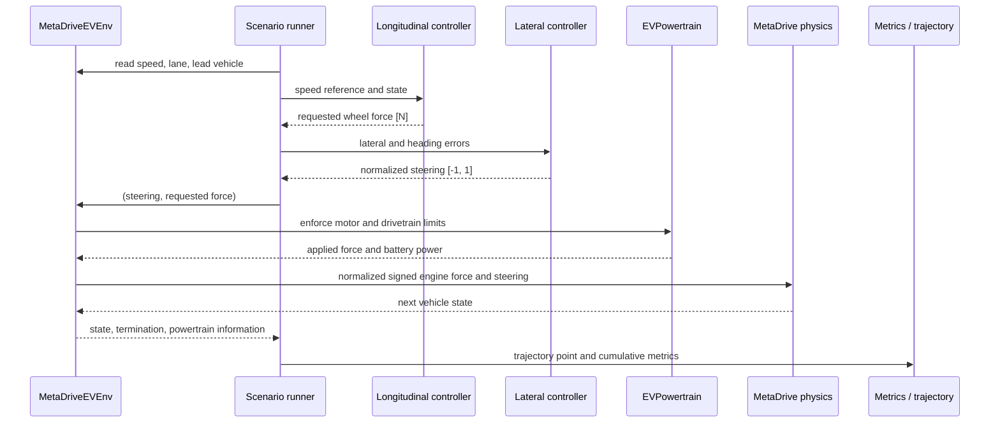

# Data flow

## One control interval

The control interval is $0.2$ s. MetaDrive advances through ten $0.02$ s physics steps per control
decision.

## Unit contract

| Signal | Unit | Producer | Consumer |
|---|---:|---|---|
| Vehicle speed | m/s | MetaDrive adapter | Controllers and metrics |
| Reference speed | m/s | Speed profile | Longitudinal controller |
| Wheel force request | N | Longitudinal controller | EV powertrain |
| Steering request | normalized $[-1,1]$ | Lateral controller | MetaDrive adapter |
| Motor speed | rad/s | EV powertrain | Limits and energy model |
| Motor torque | N·m | EV powertrain | Limits and energy model |
| Battery power | W | Energy model | Energy integrator |
| Net energy | Wh | Energy integrator | Episode metrics |
| Lane error | m | MetaDrive adapter | Lateral controller and metrics |
| Lead gap | m | MetaDrive adapter | Future safety controller/MPC |

## Failure and saturation path

1. The controller may request any force within its own output range.
2. `EVPowertrain.evaluate` converts that request to motor torque and speed.
3. Torque, power, speed, and regeneration limits clip the request.
4. `PowertrainStep.saturated` records whether clipping occurred.
5. MetaDrive receives only the feasible signed force.
6. Metrics report the saturation fraction; future MPC will include the same limits explicitly.

## Determinism

- Scenario seed is stored in `ProjectConfig`.
- MetaDrive uses one deterministic scenario and `random_traffic=False`.
- Reference profiles are immutable time/speed tables.
- Every trajectory records both requested and applied force.
- Repeated candidates can be cached by scenario, hardware, controller, and seed.

