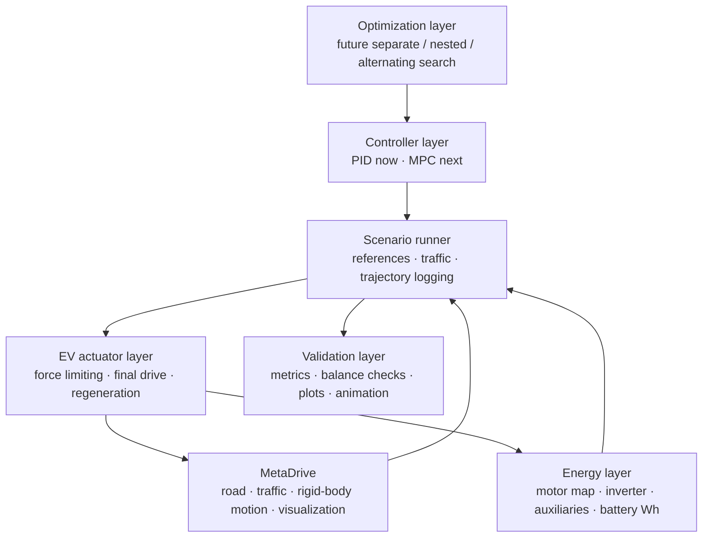

# System overview

## Purpose

The software separates environment physics, EV hardware limits, energy accounting, controller
logic, experiment execution, and optimization. This separation allows the same design variables
and metrics to be transferred from MetaDrive to CARLA later.

## Layered architecture

## Ownership boundaries

| Layer | Owns | Does not own |
|---|---|---|
| MetaDrive | Roads, traffic, collisions, wheel/chassis motion, rendering | EV efficiency and battery energy |
| EV actuator | Motor torque/power/speed limits, final-drive conversion | Road geometry or tire simulation |
| Energy model | Electrical power, regeneration, auxiliary load, Wh, SOC | Battery thermal/degradation physics |
| Controllers | Wheel-force and steering requests | Physical force saturation |
| Scenario runner | Time sequence, reference, logs, metrics | Controller internals |
| Optimization | Candidate generation and selection | Final evaluation definitions |

## Core design records

| Record | Meaning |
|---|---|
| `HardwareDesign` | Final-drive ratio $g$ and motor scale $s_m$ |
| `VehicleConfig` | Base mass, wheel radius, driveline efficiency |
| `MotorConfig` | Base torque, power, speed, mass, regeneration fraction |
| `BatteryConfig` | Capacity, inverter efficiency, auxiliary power |
| `PowertrainStep` | Requested/applied force and instantaneous energy variables |
| `EnergyState` | Integrated gross, regenerated, auxiliary, and net energy |
| `TrajectoryPoint` | Controller-independent time-series record |
| `EpisodeMetrics` | RMSE, Wh/km, comfort, lane, safety, and completion metrics |

## Source entry points

- [Configuration records](https://github.com/odetojsmith/Codesign-for-Cruise-Control/blob/main/src/codesign/config.py)
- [Powertrain and energy](https://github.com/odetojsmith/Codesign-for-Cruise-Control/blob/main/src/codesign/powertrain.py)
- [MetaDrive adapter](https://github.com/odetojsmith/Codesign-for-Cruise-Control/blob/main/src/codesign/metadrive_env.py)
- [Scenarios and metrics](https://github.com/odetojsmith/Codesign-for-Cruise-Control/blob/main/src/codesign/scenarios.py)

## Explicit boundaries

- Version one optimizes longitudinal behavior; lateral PID is fixed and used for lane keeping.
- The motor efficiency map is illustrative until replaced by traceable measured or published data.
- Battery voltage sag and degradation remain out of scope. Optional battery charge/discharge caps
  and a lumped motor thermal/torque-derating model are implemented for demanding duty cycles.
- MetaDrive is the optimization backend; CARLA is a later transfer-validation backend.
