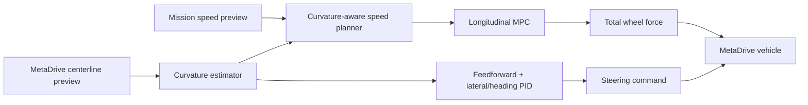

# Lateral–longitudinal coordination

The controller is hierarchical rather than a joint lateral–longitudinal MPC.

## Shared path information

The MetaDrive adapter samples heading along the current and next route lanes. A wrapped heading
difference over 2 m estimates curvature. The scenario runner queries curvature at distances derived
from the 20-step mission-speed preview.

## Feasible speed preview

The planner limits mission speed by lateral acceleration:

$$
v_{\mathrm{curve}}=\sqrt{\frac{2.0}{|\kappa|}}.
$$

Forward and backward passes apply 3 m/s² acceleration and braking limits. PID and MPC therefore
receive the same controller-independent reference, preserving fair comparison.

## Fixed lateral controller

The steering law is

$$
\delta=\tan^{-1}(L\kappa)+\delta_{\mathrm{heading\ PID}}+\delta_{\mathrm{lateral\ PID}}.
$$

It includes anti-windup, normalized steering saturation, and a 0.4-command/s steering-rate limit.
The curvature term anticipates turns; feedback corrects path and heading errors. The lateral
controller is fixed during hardware–longitudinal-controller co-design.

## Coupling retained by the longitudinal MPC

The MPC does not predict lateral PID states. Coupling enters through:

- the curvature-aware speed reference;
- curvature-dependent available longitudinal acceleration;
- MetaDrive's actual closed-loop chassis dynamics during final evaluation.

This keeps the co-design illustration compact while preventing aggressive longitudinal commands
from ignoring a curved road.
