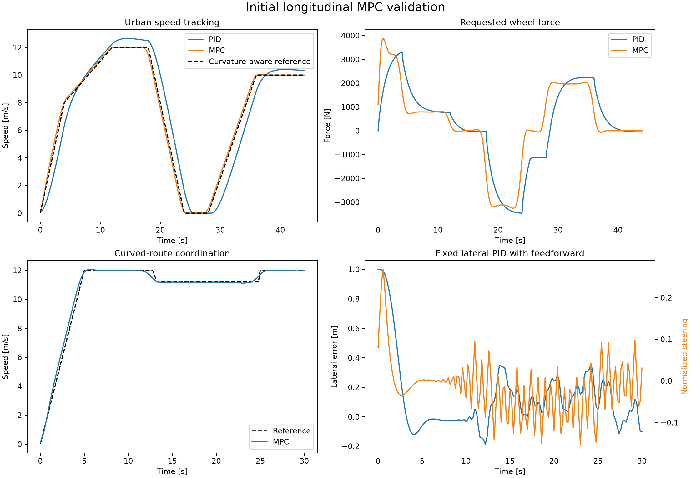

# Longitudinal MPC

The first longitudinal MPC is implemented in `mpc.py`. It replaces only the longitudinal PID;
the curvature-feedforward lateral PID remains fixed.

## Prediction model

The controller runs every 0.2 s with a 20-step, four-second horizon. Its input is total requested
wheel force. The calibrated point-mass and gap predictions are

$$
v_{k+1}=v_k+\frac{\Delta t}{m}\left(F_k-F_{g,k}\right),
$$

$$
d_{k+1}=d_k+\Delta t(v_{\mathrm{lead},k}-v_k).
$$

The lead vehicle is conservatively predicted to brake at 3 m/s² until stopped. When no lead is
present, the gap state is made inactive with a distant virtual lead.

For signed grade fraction $q_k$, the previewed gravity disturbance is
$F_{g,k}=mgq_k/\sqrt{1+q_k^2}$. Force bounds are shifted so the net longitudinal acceleration
remains inside the same comfort envelope on uphill and downhill segments.

## Objective

The normalized convex objective is

$$
J=J_v+\lambda_EJ_E+\lambda_{\Delta F}J_{\Delta F}+J_{\mathrm{safety\ slack}}.
$$

- $J_v$ is squared tracking error against the curvature-aware speed preview.
- $J_E$ is a locally linear battery-energy surrogate using separate positive and negative force.
- $J_{\Delta F}$ penalizes wheel-force changes.
- Safety slack has a large diagnostic penalty and any material use triggers bounded-braking
  fallback.

The tracking coefficient stays fixed at one. The offline design variables remain

$$
\theta=(\log_{10}\lambda_E,\log_{10}\lambda_{\Delta F})\in[-3,3]^2.
$$

The MPC energy term guides control but never supplies the final energy metric. Final Wh always
comes from the nonlinear EV energy layer.

## Constraints

The QP enforces:

- motor-speed, torque, power, regenerative, and friction-brake force bounds;
- nonnegative speed;
- 3 m/s² longitudinal acceleration;
- an internal 3.5 m/s³ force-slew limit, leaving margin for measured simulator jerk below 4 m/s³;
- curvature-dependent combined acceleration limits;
- $d\geq5+1.5v$ for lead-vehicle safety.

For predicted curvature $\kappa_k$, available longitudinal acceleration is reduced using

$$
a_{x,\max,k}=\sqrt{a_{\mathrm{combined}}^2-(v_{\mathrm{ref},k}^2\kappa_k)^2}.
$$

## Numerical implementation

CVXPY constructs the problem and OSQP solves it with warm starts. Wheel force is internally scaled
before optimization; this prevents false near-zero “optimal” solutions caused by mixing newton-scale
variables with normalized objective terms. The problem structure is built once and only parameters
are updated online.

Every solve records status, time, iterations, predicted speed, predicted gap, predicted force,
maximum safety slack, and fallback use. Solver failure or unsafe slack invokes a jerk-limited bounded
braking/proportional fallback.

## Current deterministic evidence

| Scenario | RMSE | Net energy | Peak acceleration | Peak jerk | Fallbacks |
|---|---:|---:|---:|---:|---:|
| Urban MPC | 0.232 m/s | 44.09 Wh | 2.463 m/s² | 3.500 m/s³ | 0/221 |
| Curved-route MPC | 0.202 m/s | 48.47 Wh | 3.004 m/s² | 3.500 m/s³ | 0/151 |

These results validate the initial controller, not co-design superiority. The sampled controller
tradeoff is documented in [MPC weight sampling](../optimization/mpc-tuning.md), and deterministic
lead braking is documented in [Braking validation](../validation/braking.md).

