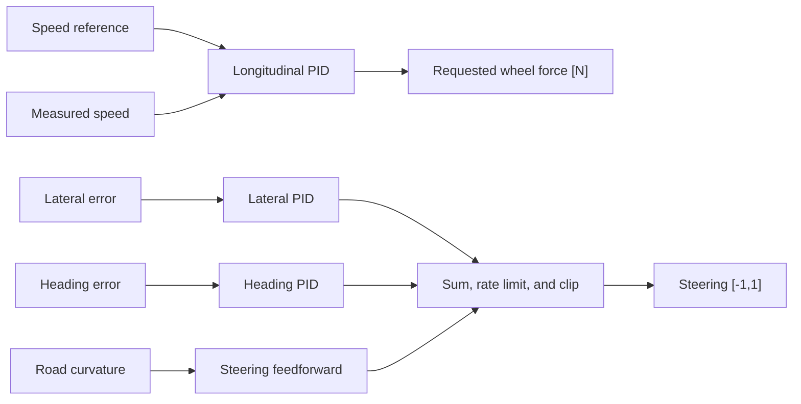

# PID controllers

The PID controllers are validation tools. They prove that the environment, actuator, energy, lane
observations, and trajectory logger form a baseline closed loop for MPC comparison.

## Longitudinal speed PID

### Purpose

Track a time-varying speed reference and output requested wheel force.

$$
e_v=v_{\mathrm{ref}}-v,
$$

$$
F_{\mathrm{req}}=K_pe_v+K_i\int e_vdt+K_d\dot e_v.
$$

### Parameters

| Parameter | Value |
|---|---:|
| $K_p$ | 1200 N/(m/s) |
| $K_i$ | 120 N/m |
| $K_d$ | 80 N·s/m |
| Force lower bound | −6000 N |
| Force upper bound | 6000 N |
| Integral bound | ±20 m |
| Sample interval | 0.2 s |

The implementation uses conditional integration: the integral is not accumulated when saturation
would drive the output further into its limit.

## Lateral centerline PID

### Purpose

Keep the vehicle near the current reference-lane center while following curves. It combines two
PID loops:

$$
\delta=\tan^{-1}(L\kappa)+\delta_{\mathrm{lateral}}+\delta_{\mathrm{heading}},
$$

then applies a 0.4-command/s rate limit and clips $\delta$ to $[-1,1]$.

### Parameters

| Loop | $K_p$ | $K_i$ | $K_d$ | Error |
|---|---:|---:|---:|---|
| Lateral | 0.30 | 0.01 | 0.01 | lane-center displacement [m] |
| Heading | 1.70 | 0.05 | 0.70 | lane minus vehicle heading [rad] |

The gains account for the project's time-normalized derivative and integral implementation. They
are equivalent in behavior to MetaDrive's discrete centerline heuristic, whose internal PID uses
raw step differences and a negated output convention.

## Controller relationship

The lateral controller is fixed during longitudinal hardware/control co-design. It prevents lane
departure from contaminating longitudinal experiments.

## Validation results

| Scenario | Initial offset | Distance | Lateral RMSE | Maximum error | Completed |
|---|---:|---:|---:|---:|---|
| Curved track | 1.0 m | 320.70 m | 0.307 m | 1.000 m | Yes |
| Urban stop-go | 0.5 m | 322.84 m | 0.120 m | 0.500 m | Yes |

Both remain within the ±1.75 m lane boundaries.

## Implementation and tests

- Implementation: [`controllers.py`](https://github.com/odetojsmith/Codesign-for-Cruise-Control/blob/main/src/codesign/controllers.py)
- Tests: [`test_controllers.py`](https://github.com/odetojsmith/Codesign-for-Cruise-Control/blob/main/tests/test_controllers.py)
- Visual evidence: [Validation evidence](../validation/evidence.md)

## Limitations

- Longitudinal PID is a baseline rather than the optimized controller.
- Speed overshoot and jerk are intentionally visible in validation plots.
- The lateral controller does not perform path planning or obstacle avoidance.
- Lead-vehicle safety is handled by the MPC, not the lateral PID.
