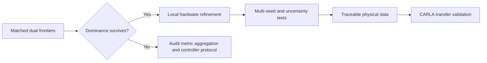

# Prioritized next steps

The next work should strengthen the scientific comparison before making the simulator larger. The
most useful immediate experiment is a matched-protocol dual-frontier study.

## Priority 0 — complete the fair dual-frontier comparison

### Why this comes first

The current evidence contains:

- a dense 40-controller frontier for trained hardware using shared controller weights;
- a single traditional reference derived from scenario-specific tuning;
- separate held-out matched-RMSE selections.

These results are encouraging but do not yet place both hardware designs on the same dense plot
under exactly the same controller-adaptation rule.

### Experiment

For traditional $(10.5,0.60)$ and trained $(11.5,0.75)$ hardware:

1. evaluate the same 40-point controller grid on all four training scenarios and all three test
   scenarios;
2. generate a **shared-controller** frontier by applying each weight pair to every scenario;
3. generate a **scenario-adaptive** frontier by independently selecting a controller per scenario
   under common RMSE bounds;
4. report mean and worst-case RMSE, Wh/km, completion, thermal, station, and fallback metrics;
5. show discrete nondominated markers without connecting lines;
6. report dominance margins at RMSE bounds 0.30, 0.35, and 0.40 m/s.

### Acceptance gate

Proceed to a larger hardware search only if trained hardware retains a clear energy advantage under
the same controller protocol and all non-RMSE constraints.

## Priority 1 — refine hardware near the current boundary

The current optimum lies near the highest top-speed-feasible ratio. Refine rather than immediately
sweeping the entire original space:

- $g\in[10.5,11.75]$ with 0.25 increments;
- $s_m\in[0.65,0.90]$ with 0.05 increments;
- identical inner controller candidates and constraints for every hardware design;
- persistent caching and parallel workers;
- nested-grid result as the reference, with Bayesian optimization as an efficiency comparison.

The result should be a hardware/controller Pareto set, not only one weighted optimum.

## Priority 2 — quantify robustness

Expand training and test distributions with:

- multiple MetaDrive seeds;
- curved mountain roads and combined steering/braking events;
- controlled lead traffic and emergency braking;
- payload, drag, tire friction, grade, temperature, and battery-power uncertainty;
- sensor noise and modest model mismatch.

Report medians, worst cases, confidence intervals, failure counts, and paired energy differences.
One deterministic rollout per scenario is not enough for a final generality claim.

## Priority 3 — replace illustrative physical data

Before interpreting Wh/km quantitatively:

1. import a traceable motor efficiency and torque-speed map;
2. calibrate inverter, gearbox, auxiliary, battery-power, and thermal parameters;
3. validate forward energy reconstruction against a published drive cycle;
4. perform sensitivity analysis for uncertain map and thermal parameters.

The current synthetic map is suitable for demonstrating optimization logic, not production sizing.

## Priority 4 — simulator transfer

Export the traditional, trained, and local-refinement designs to CARLA on the Windows RTX 5060 Ti
machine. Re-run representative flat, curved, mountain, and traffic scenarios with the same reference
profiles and metrics. Compare ranking consistency rather than expecting identical absolute energy.

## Recommended execution order

## Immediate deliverables

The next milestone should contain:

- one CSV with both hardware designs and identical controller samples;
- training and held-out dual-frontier plots;
- a table of minimum energy at fixed RMSE bounds;
- worst-case scenario metrics and constraint violations;
- updated MkDocs evidence and a machine-readable report;
- a Git commit pushed immediately after verification.

