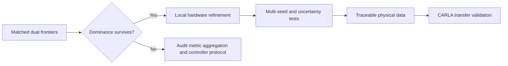

# Prioritized next steps

The 30-training/10-test expansion is complete. It confirms all five unseen interpolation cases but
also identifies two jointly infeasible stress missions and one feasible case without strict
matched-RMSE dominance. The immediate work should now address this robustness boundary.

## Priority 0 — diagnose and formalize stress robustness

1. Audit whether `stress_01` and `stress_04` contain physically attainable speed/station
   references under their payload, grade, and battery limits.
2. Separate reference infeasibility from controller failure and hardware incapability.
3. Add a stress subset to hardware training rather than exposing every extreme only at test time.
4. Compare mean-energy selection with worst-case and CVaR objectives.
5. Preserve common-threshold and strict matched-RMSE results as separate claims.

### Acceptance gate

Proceed to local hardware refinement only after the mission-feasibility audit and a robust objective
are fixed. The current expanded benchmark saves energy on all eight common-feasible unseen cases,
but universal extrapolation has not been established.

## Priority 1 — refine hardware near the current boundary

The current optimum lies near the highest top-speed-feasible ratio. Refine rather than immediately
sweeping the entire original space:

- $g\in[10.5,11.75]$ with 0.25 increments;
- $s_m\in[0.65,0.90]$ with 0.05 increments;
- identical inner controller candidates and constraints for every hardware design;
- persistent caching and parallel workers;
- nested-grid result as the reference, with Bayesian optimization as an efficiency comparison.

The result should be a hardware/controller Pareto set, not only one weighted optimum.

## Priority 2 — quantify robustness

Expand training and test distributions with:

- multiple MetaDrive seeds;
- curved mountain roads and combined steering/braking events;
- controlled lead traffic and emergency braking;
- payload, drag, tire friction, grade, temperature, and battery-power uncertainty;
- sensor noise and modest model mismatch.

Report medians, worst cases, confidence intervals, failure counts, and paired energy differences.
One deterministic rollout per scenario is not enough for a final generality claim.

## Priority 3 — replace illustrative physical data

Before interpreting Wh/km quantitatively:

1. import a traceable motor efficiency and torque-speed map;
2. calibrate inverter, gearbox, auxiliary, battery-power, and thermal parameters;
3. validate forward energy reconstruction against a published drive cycle;
4. perform sensitivity analysis for uncertain map and thermal parameters.

The current synthetic map is suitable for demonstrating optimization logic, not production sizing.

## Priority 4 — simulator transfer

Export the traditional, trained, and local-refinement designs to CARLA on the Windows RTX 5060 Ti
machine. Re-run representative flat, curved, mountain, and traffic scenarios with the same reference
profiles and metrics. Compare ranking consistency rather than expecting identical absolute energy.

## Recommended execution order

## Immediate deliverables

The next milestone should contain:

- one CSV with both hardware designs and identical controller samples;
- training and held-out dual-frontier plots;
- a table of minimum energy at fixed RMSE bounds;
- worst-case scenario metrics and constraint violations;
- updated MkDocs evidence and a machine-readable report;
- a Git commit pushed immediately after verification.
