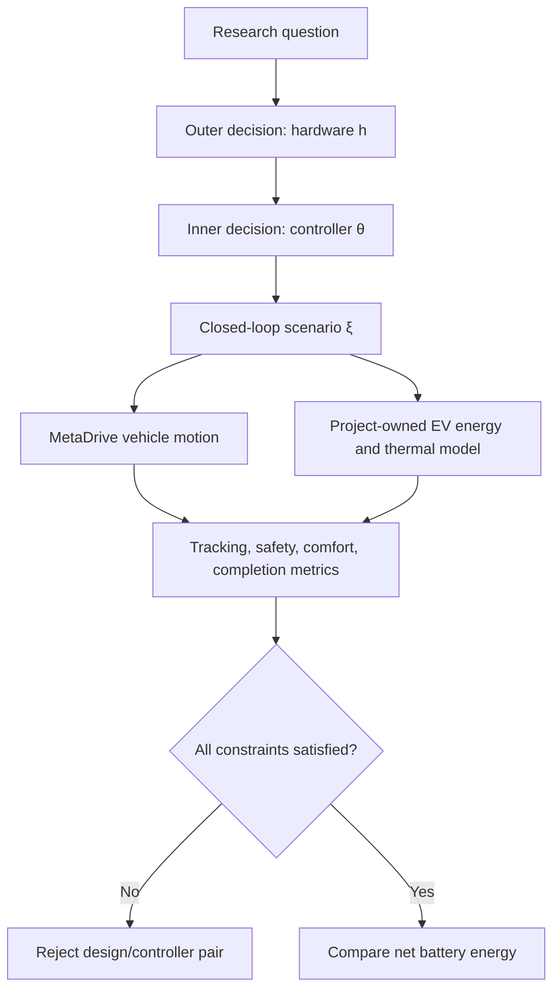
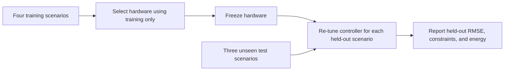

# End-to-end project logic

This page is the shortest complete explanation of the project. It states what is optimized, how
the simulator is organized, why the comparison is fair, and how each experiment supports the next.

## 1. Central research question

Can an autonomous electric vehicle designed together with its controller use less battery energy
than a conventionally sized vehicle whose controller is tuned afterward, while meeting the same
tracking, safety, comfort, and mission requirements?

The hardware variables are deliberately small:

$$
h=(g,s_m),
$$

where $g$ is the final-drive ratio and $s_m$ scales motor torque, power, mass, and thermal capacity.
The controller variables are

$$
\theta=(\log_{10}\lambda_E,\log_{10}\lambda_{\Delta u}),
$$

the MPC weights on electrical energy and force slew. Road, payload, temperature, traffic, and
reference-profile conditions are collected in scenario $\xi$.

## 2. The hierarchy

Hardware is manufactured once. Controller weights may still be calibrated after hardware is
fixed. This distinction is essential: hardware generalization is tested with frozen hardware, not
with a frozen controller.

## 3. One simulation step

At every control interval:

1. MetaDrive provides speed, lane state, path curvature, lead-vehicle state, and route progress.
2. The speed planner lowers the reference when curvature or braking feasibility requires it.
3. The lateral PID computes steering; longitudinal MPC computes desired tire force.
4. The powertrain converts tire force through final drive and motor limits.
5. Battery-power and thermal limits may reduce traction or regeneration.
6. Regeneration is supplemented by friction braking when necessary.
7. MetaDrive advances the chassis using the delivered force and steering.
8. The project records tracking, lane, safety, comfort, power, energy, and thermal signals.

The detailed signal and unit contract is in [Data flow](../architecture/data-flow.md).

## 4. Why hardware affects closed-loop control

The final-drive ratio changes motor speed and wheel torque:

$$
\omega_m = g\frac{v}{r_w},\qquad
F_w \approx \frac{\eta_g g T_m}{r_w}.
$$

Motor scale changes peak torque, peak power, mass, efficiency-map operating points, regenerative
capacity, and thermal behavior. Consequently, the same controller request can produce different
acceleration, saturation, braking split, tracking error, and energy for different hardware.

This coupling is weak on easy flat routes and strong near torque, speed, battery-power, thermal, or
regenerative limits. The mountain-shuttle scenarios were introduced specifically to expose it.

## 5. Controller architecture

Lateral and longitudinal control have different roles:

- a centerline PID steers the vehicle using curvature feedforward and lateral-error feedback;
- a curvature-aware planner reduces the feasible speed before strong steering;
- longitudinal MPC follows that feasible speed while respecting force, acceleration, jerk, gap,
  curvature, battery, and hardware constraints.

The longitudinal MPC does not predict full lateral dynamics. Lateral influence enters through the
curvature-dependent speed reference and longitudinal acceleration limits. This is an intentional
hierarchical approximation, documented in [Lateral–longitudinal coordination](../control/coordination.md).

## 6. Fair comparison logic

### Traditional separate design

The conventional baseline does not use closed-loop RMSE during hardware sizing:

1. sweep 117 $(g,s_m)$ candidates;
2. enforce top speed, acceleration, gradeability, and exact-speed-cycle feasibility;
3. minimize backward-facing cycle energy, with mass and ratio tie-breaks;
4. freeze the selected hardware at $(10.5,0.60)$;
5. tune its controller afterward.

This represents capability- and cycle-based drivetrain sizing. See
[Conventional separate design](../optimization/separate-design.md).

### Integrated co-design

Co-design evaluates hardware through closed-loop missions:

$$
\min_{h,\theta} E(h,\theta,\xi)
$$

subject to an externally specified RMSE bound and all mission constraints. The controller's
internal energy/tracking weights are search variables, not the final score.

This resolves an early logical problem: a controller that emphasizes tracking should not be called
“better” merely because it tracks better. Designs are compared by energy only after satisfying the
same externally imposed performance requirement. Full Pareto markers are also reported so the
tradeoff remains visible.

## 7. Training and testing logic

The generalization experiment separates selection from evaluation:

Test scenarios never change hardware. Controller adaptation after freezing is allowed because a
real vehicle can receive route- or condition-specific calibration after manufacture.

Two controller protocols answer different questions:

- **scenario-specific tuning:** best controller for each fixed hardware/scenario pair;
- **shared-controller sweep:** one weight pair evaluated across all training scenarios to expose a
  clean controller Pareto set.

These protocols must not be silently mixed. The evidence pages state which one is used.

## 8. Validation logic

Evidence is layered so a high-level optimization result is not trusted before its components:

1. **Actuator delivery:** intended traction, regeneration, friction braking, and steering reach the
   simulated chassis correctly.
2. **Energy consistency:** mechanical, electrical, and integrated-energy balances close.
3. **Baseline control:** PID keeps the car near the lane center and tracks deterministic profiles.
4. **MPC behavior:** tracking, jerk, constraints, gap, braking, and fallback diagnostics pass.
5. **Hardware relevance:** hardware changes force limits, efficiency, regeneration, and performance.
6. **Co-design evidence:** separate and integrated methods are compared under shared constraints.
7. **Generalization:** hardware selected on training missions is tested on unseen missions.

The numerical evidence for each layer is summarized in [Evidence summary](evidence-summary.md).

## 9. Current conclusion

Within the implemented illustrative MetaDrive/EV model, the evidence supports this narrower claim:

> Closed-loop controller evaluation can guide hardware selection toward designs that use less
> modeled battery energy while matching or improving tracking, and the advantage persists on the
> current unseen in-range mountain-driving scenarios. Under harder extrapolation, the selected
> hardware retains an energy advantage where both designs remain feasible, but universal
> feasibility and matched-RMSE dominance are not established.

It does not yet establish production-EV energy accuracy, global optimality, arbitrary-scene
generality, or CARLA transfer. Those boundaries determine the [next steps](next-steps.md).
