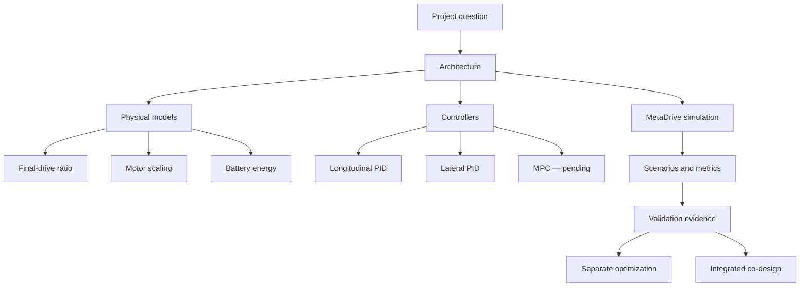

# Codesign for Cruise Control

This site is the authoritative implementation guide for the autonomous-electric-vehicle
hardware–controller co-design project. It connects every project claim to its physical model,
source file, test, and validation evidence.

!!! info "Current boundary"
    The MetaDrive simulation, hardware-dependent actuator, EV energy accounting, deterministic
    scenarios, PID validation controllers, metrics, and visual validation are implemented. The
    next design decision is the longitudinal MPC formulation.

## Project question

Can a vehicle designed together with its controller consume less energy than a conventionally
sized vehicle whose controller is tuned afterward, while satisfying the same speed-tracking and
safety requirements?

The final comparison is constrained rather than based on a subjective weighted score:

$$
\min_{h,\theta} E_{\mathrm{net}}(h,\theta)
\quad \text{subject to} \quad
\operatorname{RMSE}_v(h,\theta) \leq \epsilon.
$$

Here, $h=(g,s_m)$ contains the hardware decisions and $\theta$ contains controller parameters.

## Knowledge map



## Guided entry points

| If you want to understand… | Start here |
|---|---|
| How the complete system fits together | [System overview](architecture/system-overview.md) |
| What information moves through one simulation step | [Data flow](architecture/data-flow.md) |
| How final drive and motor size affect the car | [Hardware design](models/hardware.md) |
| How Wh and regeneration are calculated | [EV energy model](models/energy.md) |
| How longitudinal and lateral PID differ | [PID controllers](control/pid.md) |
| Why the actuator and energy layers are credible | [Validation evidence](validation/evidence.md) |
| Which source file implements a feature | [File inventory](reference/files.md) |
| Which test supports a requirement | [Traceability matrix](reference/traceability.md) |

## Implementation status

| Subsystem | Status | Evidence |
|---|---|---|
| Hardware configuration | Implemented | Unit tests and force calibration |
| Signed traction/regeneration actuator | Implemented | Less than 0.01% force error |
| Battery energy accounting | Implemented | Numerical power and energy balance |
| MetaDrive environment | Implemented | Headless and visual scenarios |
| Longitudinal speed PID | Implemented for validation | Urban and curved-track runs |
| Lateral centerline PID | Implemented for validation | Top-down animation and lane metrics |
| Longitudinal MPC | Pending design | [Decision boundary](control/mpc.md) |
| Separate optimization | Planned | [Method specification](optimization/separate-design.md) |
| Integrated co-design | Planned | [Method specification](optimization/codesign.md) |
| CARLA validation | Planned for Windows | Export adapter not yet implemented |

## Reproduce the current evidence

```bash
python3.11 -m venv .venv
source .venv/bin/activate
python -m pip install -e '.[simulation,dev]'
pytest
python -m codesign.validation_cli
```

The validation command fails if actuator calibration, lane completion, or energy-balance checks
do not satisfy their acceptance limits.

