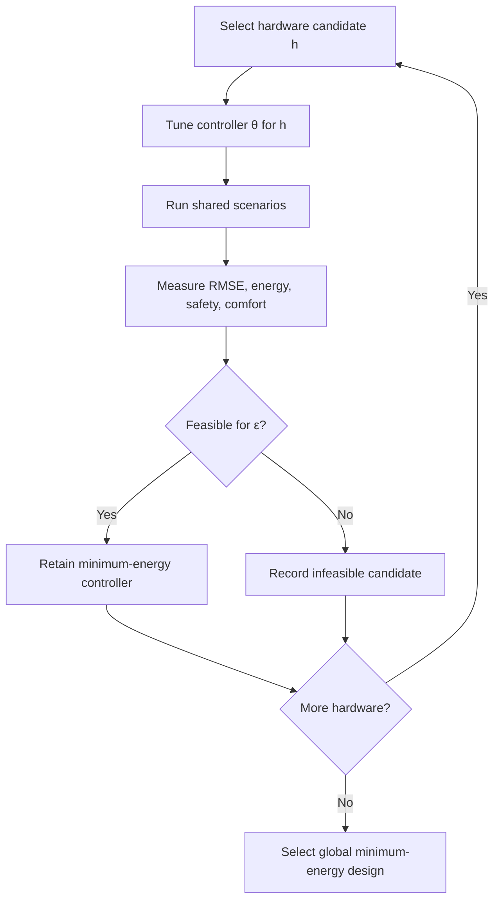

# Integrated co-design

!!! note "Planned"
    Search and optimization are specified but not implemented. The simulator and evaluation
    foundation they require are implemented.

## Objective

For tracking limits

$$
\epsilon\in\{0.1,0.2,0.4,0.8\}\ \mathrm{m/s},
$$

solve

$$
\begin{aligned}
\min_{h,\theta}\quad &E_{\mathrm{net}}(h,\theta)\\
\text{subject to}\quad
&\operatorname{RMSE}_v(h,\theta)\leq\epsilon,\\
&d_{\min}\geq d_{\mathrm{safe}},\\
&|a|\leq3.0\ \mathrm{m/s^2},\\
&|j|\leq4.0\ \mathrm{m/s^3},\\
&\text{hardware and road constraints hold.}
\end{aligned}
$$

## Hardware grid

| Variable | Grid |
|---|---|
| Final-drive ratio | $6,6.5,\ldots,12$ |
| Motor scale | $0.6,0.7,\ldots,1.4$ |

For every hardware point, run 60 seeded Optuna trials for the two controller parameters. Cache all
evaluations and retain the minimum-energy feasible controller for each tracking limit.

## Nested workflow

## Alternating illustration

Starting from conventional hardware and nominal controller:

1. optimize controller with hardware fixed;
2. optimize hardware with controller fixed;
3. repeat up to six iterations or until energy improvement is below 0.1%.

Alternating optimization is an illustration of coupling, not proof of global optimality. Its result
must be compared with the nested hardware-grid result.

## Evidence standard

Co-design is better only where its energy–RMSE Pareto frontier dominates the separate-design
frontier. If the frontiers cross, report the operating regions where each method is preferable.

