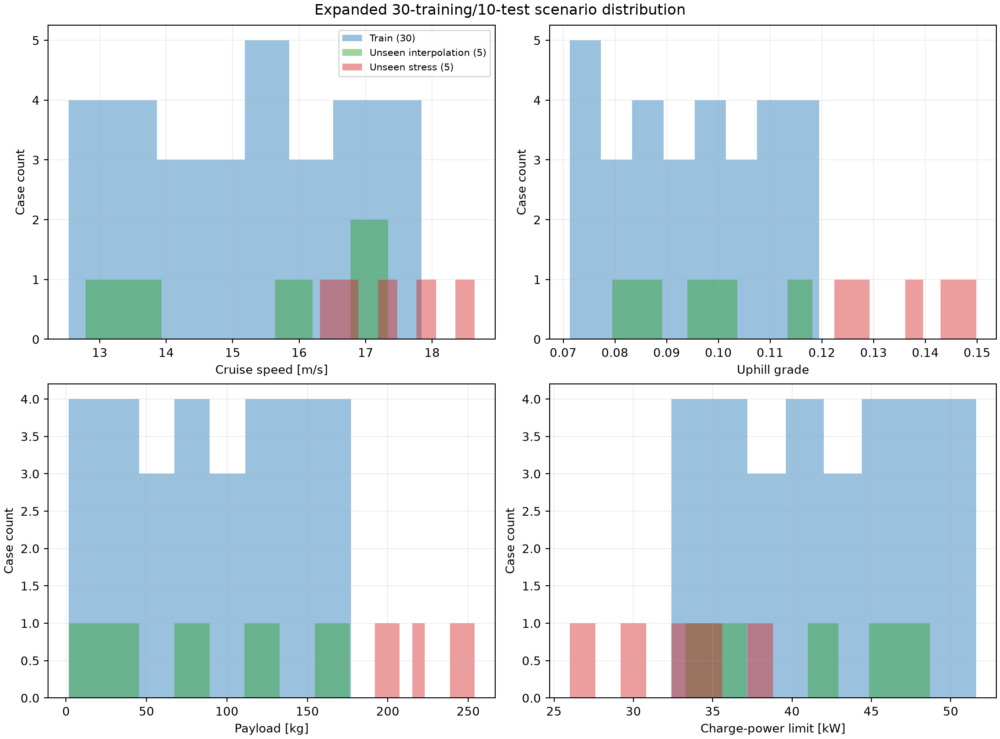
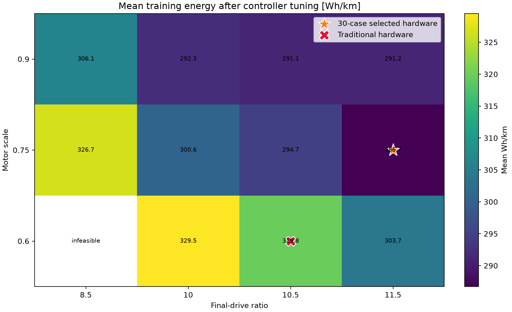
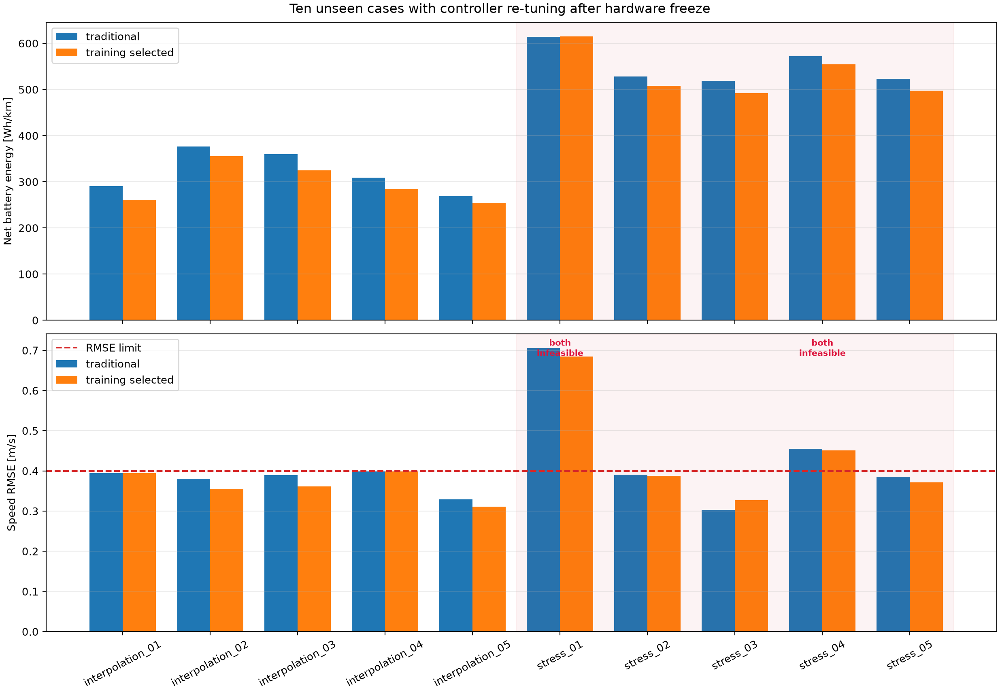

# Expanded 30-training/10-test benchmark

!!! info "Larger benchmark completed"
    Hardware was selected from 30 training cases and then frozen before 10 unseen evaluations.
    The experiment contains 6,200 cached closed-loop controller evaluations.

## Why expand the dataset

The original four-training/three-test split demonstrated the workflow but was too small for a
convincing generalization claim. The expanded benchmark asks two separate questions:

1. Does the selected hardware generalize to new combinations drawn from the training ranges?
2. What happens when it encounters deliberately harder conditions beyond those ranges?

The second question is a stress test, not an expectation that every design must remain feasible.

## Reproducible scenario generation

Thirty training cases use deterministic Latin-hypercube sampling. Each of 13 scenario dimensions
occupies every one of 30 equal-probability strata exactly once, reducing gaps and clustering
compared with independent random sampling.

The ten test cases use disjoint names, simulator seeds, and Latin-hypercube seeds:

- five **interpolation** cases are new combinations within the training ranges;
- five **stress** cases use harder, partly out-of-range conditions.

| Parameter | Training and interpolation | Stress test |
|---|---:|---:|
| Cruise speed | 12.5–18.0 m/s | 16.0–19.0 m/s |
| Uphill grade | 7–12% | 12–15% |
| Downhill magnitude | 7–13% | 12–15% |
| Payload | 0–180 kg | 180–260 kg |
| Drag multiplier | 0.98–1.10 | 1.08–1.15 |
| Initial motor temperature | 50–68°C | 65–75°C |
| Battery discharge limit | 85–100 kW | 75–90 kW |
| Regenerative charge limit | 32–52 kW | 25–40 kW |
| Repeated cycles | 2 or 3 | 2 or 3 |

Launch, cruise, braking, and station-dwell durations are sampled independently as well.



## Leakage and optimization protocol

Test cases never influence hardware selection.

### Training stage

- 12 top-speed-feasible hardware designs;
- 30 training cases;
- 15 MPC weight pairs per hardware/case;
- 5,400 closed-loop evaluations;
- hardware must have at least one fully feasible controller on every training case;
- select minimum mean Wh/km after per-case controller tuning.

### Testing stage

- freeze traditional and training-selected hardware;
- evaluate the same dense 40-controller grid for each design on each unseen case;
- 800 closed-loop evaluations;
- tune traditional hardware under RMSE ≤0.4 m/s;
- require selected hardware to stay below the traditional achieved RMSE when possible;
- if exact matching is impossible, retain the best mission-feasible tracking controller and mark
  the case as unmatched rather than selecting an incomplete rollout.

Six process-isolated workers reduce runtime; they do not alter scenario definitions, controller
grids, metrics, or selection rules. A persistent cache makes the experiment resumable.

## Thirty-case hardware result

| Hardware | Feasible training cases | Mean RMSE | Mean energy |
|---|---:|---:|---:|
| Traditional $(10.5,0.60)$ | 30/30 | 0.36136 m/s | 319.80 Wh/km |
| Training-selected $(11.5,0.75)$ | 30/30 | 0.36077 m/s | **286.71 Wh/km** |

The same hardware found by the smaller benchmark is selected again. Its mean training energy is
**10.35% lower**, with slightly lower mean RMSE.



## Ten unseen cases



The pale red region identifies the five deliberately harder stress cases. “Both infeasible” means
neither hardware/controller search satisfies all global mission constraints; those cases are not
included in energy averages.

| Test group | Fully feasible pairs | Matched-RMSE cases | Mean traditional | Mean selected | Energy reduction |
|---|---:|---:|---:|---:|---:|
| Unseen interpolation | 5/5 | 5/5 | 320.89 Wh/km | **295.95 Wh/km** | **7.77%** |
| Unseen stress | 3/5 | 2/3 | 523.26 Wh/km | **499.52 Wh/km** | **4.54%** |
| All common-threshold-feasible | 8/10 | 7/8 | 396.78 Wh/km | **372.29 Wh/km** | **6.17%** |

The selected hardware saves energy on all eight cases where both designs satisfy the common
0.4 m/s tracking and mission requirements.

### Stress-case boundary

- `stress_01`: both designs fail RMSE, progress, and station constraints;
- `stress_04`: both exceed the 0.4 m/s RMSE limit;
- `stress_03`: both satisfy the common 0.4 m/s limit, and selected hardware saves 5.01% energy,
  but its best mission-feasible RMSE is 0.3270 m/s versus the traditional design's 0.3033 m/s.

Therefore the expanded result supports interpolation generalization and a qualified stress-case
energy advantage, but not universal matched-RMSE dominance under arbitrary extrapolation.

## Reproduce and inspect

```bash
codesign-expanded-generality --workers 6
```

Outputs under `artifacts/expanded_generality/` include the fixed manifest, resumable 6,200-entry
cache, training selections, hardware summary, test selections, comparisons, plots, and JSON report.
The exact 40-case input manifest is also versioned at `datasets/expanded_30_10_manifest.csv`.

Implementation: `src/codesign/expanded_generality.py`.

## Next implication

The next hardware objective should include stress robustness rather than optimizing only mean
in-range energy. Candidate formulations include a minimum training-feasibility rate, worst-case or
CVaR energy, and explicit progress/station constraints on a small stress subset. The two infeasible
cases should also be checked for physically unattainable reference profiles before treating them
as hardware failures.
