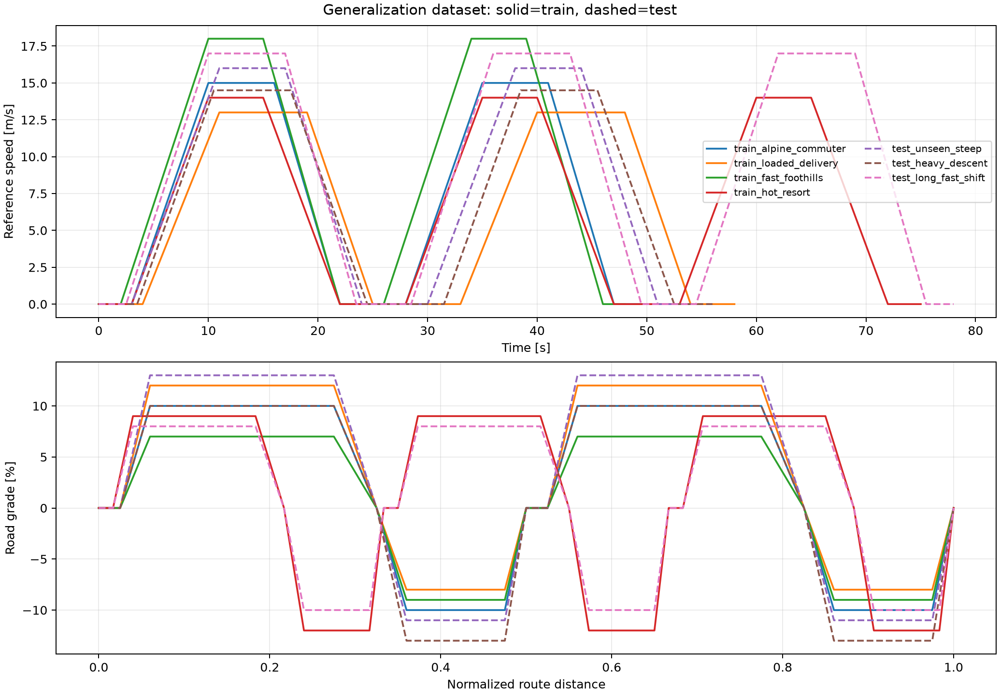
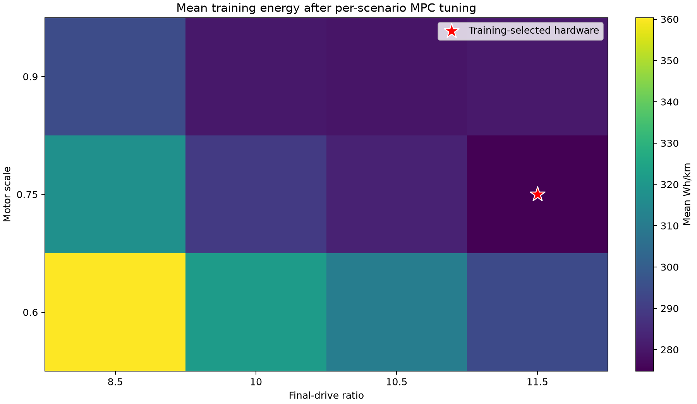
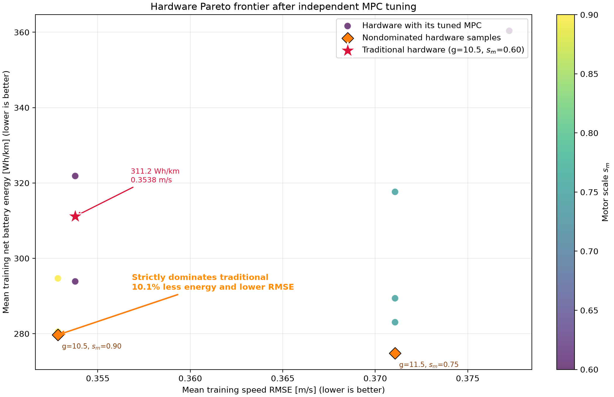
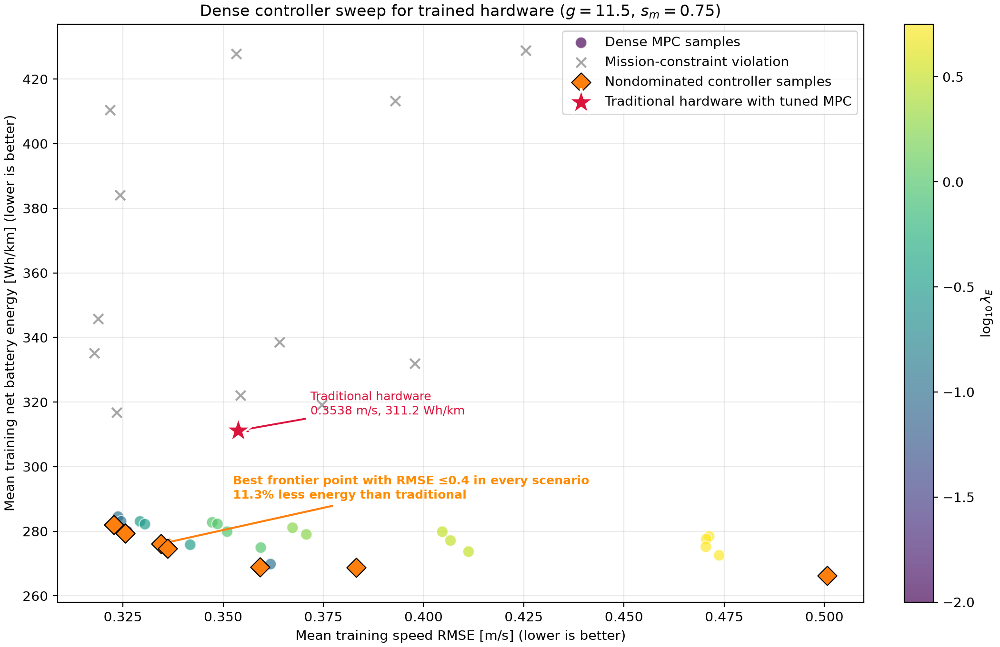
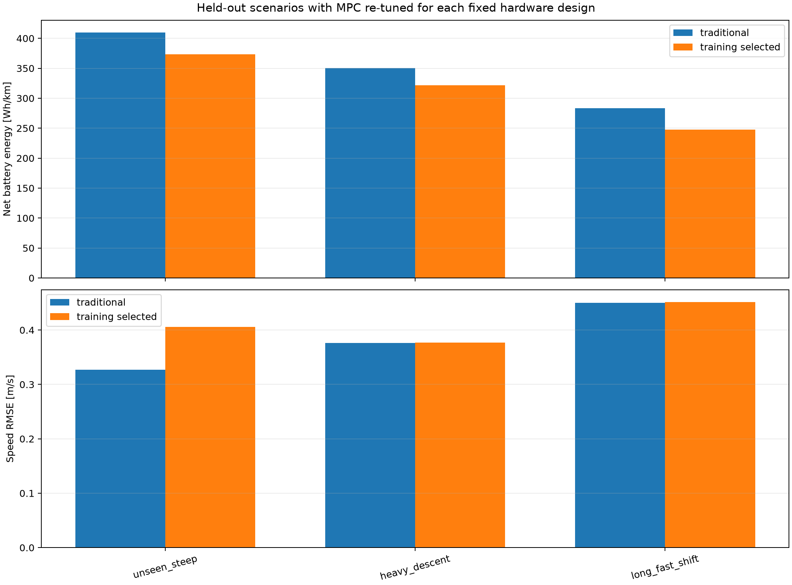

# Train/test generalization dataset

!!! success "Held-out improvement confirmed"
    Hardware selected using four training scenarios reduced mean energy by 9.22% on three unseen
    test scenarios. The hardware was frozen before test evaluation, while MPC weights were
    re-optimized independently for every scenario.

## Experimental protocol

The experiment separates hardware learning from controller adaptation:

1. Generate a versioned manifest containing four training and three test scenarios.
2. For every training scenario and hardware candidate, tune the MPC weights independently.
3. Reject hardware unless at least one controller satisfies all constraints on every training
   scenario.
4. Select hardware minimizing the equally weighted mean training Wh/km.
5. Freeze the selected hardware.
6. On each held-out test scenario, tune only the MPC weights again. Test information never changes
   the hardware.

This models a realistic design hierarchy: the physical vehicle is manufactured once, but its
controller can be calibrated for a known route or operating condition.

## Dataset

Scenario parameters vary speed, uphill and downhill grade, cycle count, payload, aerodynamic drag,
initial motor temperature, battery power limits, and MetaDrive seed.

| Split | Scenario | Speed | Grade | Distinguishing condition |
|---|---|---:|---:|---|
| Train | Alpine commuter | 15 m/s | +10/−10% | Nominal repeated hills |
| Train | Loaded delivery | 13 m/s | +12/−8% | +150 kg payload |
| Train | Fast foothills | 18 m/s | +7/−9% | +8% drag, high speed |
| Train | Hot resort | 14 m/s | +9/−12% | Three cycles, 65 °C initial motor |
| Test | Unseen steep | 16 m/s | +13/−11% | Unseen steep climb and seed |
| Test | Heavy descent | 14.5 m/s | +10/−13% | +225 kg and limited charging |
| Test | Long fast shift | 17 m/s | +8/−10% | Three cycles, +10% drag |



Solid traces are training data and dashed traces are held-out test data. Test definitions are
stored in the manifest before optimization, but are not evaluated during hardware selection.

## Feasibility and objective

For every scenario, controller tuning minimizes Wh/km subject to:

- speed RMSE ≤0.4 m/s;
- terminal progress ≥98.5%;
- station distance error ≤12 m;
- station speed ≤1.5 m/s;
- episode completion with no MPC fallback;
- motor temperature ≤112 °C.

The hardware objective is the mean of the four independently optimized training Wh/km values. This
gives every training scenario equal influence despite different route lengths.

## Training result

The corrected quick grid proposed 15 hardware designs, rejected three that violated the shared
120 km/h motor-speed requirement, and ran 720 training evaluations: 12 hardware designs by 15
controller settings by four scenarios. The controller grid samples
$\log_{10}\lambda_E\in\{-1.5,-1,-0.5,0,0.5\}$ and
$\log_{10}\lambda_{\Delta u}\in\{-1.5,-1,-0.5\}$.

| Hardware | Mean training energy | Maximum training RMSE |
|---|---:|---:|
| Conventional $g=10.5,s_m=0.60$ | 311.15 Wh/km | 0.3962 m/s |
| Training-selected $g=11.5,s_m=0.75$ | **274.79 Wh/km** | 0.3978 m/s |



### RMSE–energy Pareto frontier after controller tuning

The map above shows only energy. The following plot retains both control objectives. Each circle is
one hardware design **after its MPC has been tuned independently on each training scenario**. For
each hardware/scenario pair, the plotted data use the minimum-energy controller satisfying RMSE
≤0.4 m/s and all mission constraints. The coordinates are then the equally weighted means over the
four training scenarios:

$$
\bar e(h)=\frac{1}{4}\sum_{i=1}^{4}\operatorname{RMSE}_i(h,\theta_i^*),\qquad
\bar E(h)=\frac{1}{4}\sum_{i=1}^{4}E_i(h,\theta_i^*).
$$

Thus, the comparison does not penalize one hardware design by forcing it to use another design's
controller. Orange diamonds identify hardware points for which no other sampled design has both
lower mean RMSE and lower mean energy. The diamonds are deliberately **not connected**: these are
discrete sampled designs, not a continuous interpolated curve.



| Point | Mean RMSE | Mean energy | Relation to traditional |
|---|---:|---:|---|
| Traditional $g=10.5,s_m=0.60$ | 0.35378 m/s | 311.15 Wh/km | Dominated |
| Frontier $g=10.5,s_m=0.90$ | **0.35284 m/s** | **279.67 Wh/km** | Lower RMSE and **10.12% less energy** |
| Frontier $g=11.5,s_m=0.75$ | 0.37107 m/s | **274.79 Wh/km** | Lowest-energy feasible hardware |

The strongest like-for-like observation is the first frontier point. It has the same final-drive
ratio as the traditional design, but its larger motor changes the efficiency, regenerative-braking,
and saturation behavior enough to reduce energy by 31.48 Wh/km while also slightly improving
tracking. Therefore the traditional point is strictly inside the dominated region, not merely at a
different preference along the frontier.

### Dense controller frontier for the trained hardware

The hardware plot above gives only two nondominated hardware samples because the hardware grid is
small. To reveal the controller tradeoff more clearly, a second experiment fixes the trained
hardware at $g=11.5,s_m=0.75$ and evaluates 40 shared MPC weight pairs:

$$
\log_{10}\lambda_E\in\{-2,-1.5,-1,-0.5,0,0.25,0.5,0.75\},
$$

$$
\log_{10}\lambda_{\Delta u}\in\{-2,-1.5,-1,-0.5,0\}.
$$

Every weight pair runs on all four training scenarios, producing 160 closed-loop evaluations. A
point is rejected only for completion, station, progress, thermal, or MPC-fallback failure. RMSE is
not used to hide points because it is one of the plotted objectives. Orange diamonds are the seven
nondominated sampled controllers; they are not joined by a line.



Three of the seven frontier controllers also satisfy RMSE ≤0.4 m/s in **every** training scenario.
The best-energy one is
$(\log_{10}\lambda_E,\log_{10}\lambda_{\Delta u})=(-1.5,-0.5)$:

| Design and controller | Mean RMSE | Maximum scenario RMSE | Mean energy |
|---|---:|---:|---:|
| Traditional hardware with independently tuned MPC | 0.35378 m/s | ≤0.4 m/s | 311.15 Wh/km |
| Trained hardware, shared weights $(-1.5,-0.5)$ | **0.33446 m/s** | **0.39783 m/s** | **276.09 Wh/km** |

Even though the trained hardware uses one shared weight pair across all four scenarios while the
traditional reference was allowed independent scenario tuning, this controller lowers mean RMSE
and lowers mean energy by **11.27%**. Points farther right show additional energy savings only by
accepting larger tracking error, which is the tradeoff the denser frontier is intended to expose.

Controller adaptation was active rather than nominally allowed. For the selected hardware,
$\log_{10}\lambda_E$ was −0.5, 0.5, −1.5, and 0.5 across the four training scenarios; the selected
slew weight was −0.5. Each choice is the minimum-energy point satisfying RMSE ≤0.4 m/s.

## Held-out test result

Both hardware designs were frozen. For fairness, each received an independent 15-point MPC search
on every test scenario.

| Held-out scenario | Traditional Wh/km | Selected Wh/km | Traditional RMSE | Selected RMSE |
|---|---:|---:|---:|---:|
| Unseen steep | 405.63 | **372.26** | 0.3351 | 0.3563 |
| Heavy descent | 345.21 | **318.62** | 0.3811 | 0.3816 |
| Long fast shift | 281.91 | **246.61** | 0.3727 | 0.3986 |
| **Mean** | **344.25** | **312.50** | — | — |

The training-selected hardware reduces mean held-out energy by **9.22%** and wins on every test
scenario. All six test hardware/scenario combinations satisfy the 0.4 m/s tracking threshold and
mission constraints.



The unseen-steep case illustrates why the final comparison uses a constraint rather than a weighted
score: selected hardware accepts a modest RMSE increase while remaining feasible and uses 8.23%
less energy. The other two cases also remain below the common threshold and use less energy.

## Reproduce and inspect

```bash
codesign-generality-dataset --quick
codesign-trained-controller-sweep
```

`artifacts/generality_dataset/` contains:

- `scenario_manifest.csv` and `.json`;
- all raw controller evaluations;
- per-scenario training controller selections;
- the aggregate hardware table;
- held-out test selections;
- a resumable JSON evaluation cache;
- plots and a machine-readable report.

The dense controller sweep additionally writes its 40-point summary, 160 raw scenario evaluations,
plot, and JSON report under `artifacts/trained_hardware_controller_sweep/`.

Implementation: [`generality_dataset.py`](https://github.com/odetojsmith/Codesign-for-Cruise-Control/blob/main/src/codesign/generality_dataset.py).

## Interpretation boundary

This result establishes generalization across a small designed family of longitudinal hill
missions, not across arbitrary autonomous-driving scenes. The selected ratio is the largest
candidate satisfying the shared 120 km/h motor-speed requirement, so refinement should concentrate
near that feasibility boundary. Sourced efficiency/thermal data, more seeds, traffic, curvature,
friction perturbations, and CARLA transfer remain necessary before a physical design claim.
