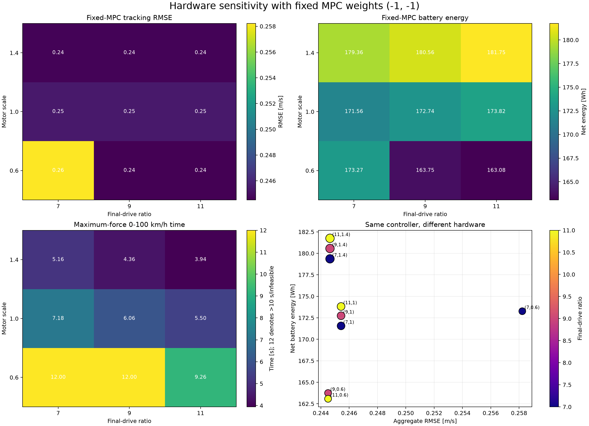

# Hardware sensitivity with a fixed controller

This experiment isolates hardware effects from controller tuning. Every design uses the same MPC
weights

$$
(\log_{10}\lambda_E,\log_{10}\lambda_{\Delta F})=(-1,-1),
$$

and runs the same urban, compact-highway, and ±6% grade scenarios with seed 7.

## Sampled hardware

The experiment evaluates the Cartesian product

$$
g\in\{7,9,11\},\qquad s_m\in\{0.6,1.0,1.4\}.
$$



## Results

| Final drive | Motor scale | Aggregate RMSE | Net energy | 0–100 km/h | Conventional feasibility |
|---:|---:|---:|---:|---:|---|
| 7 | 0.6 | 0.258 m/s | 173.27 Wh | Infeasible | Fail |
| 9 | 0.6 | 0.245 m/s | 163.75 Wh | Infeasible | Fail |
| 11 | 0.6 | 0.245 m/s | 163.08 Wh | 9.26 s | Pass |
| 7 | 1.0 | 0.245 m/s | 171.56 Wh | 7.18 s | Pass |
| 9 | 1.0 | 0.245 m/s | 172.74 Wh | 6.06 s | Pass |
| 11 | 1.0 | 0.245 m/s | 173.82 Wh | 5.50 s | Pass |
| 7 | 1.4 | 0.245 m/s | 179.36 Wh | 5.16 s | Pass |
| 9 | 1.4 | 0.245 m/s | 180.56 Wh | 4.36 s | Pass |
| 11 | 1.4 | 0.245 m/s | 181.75 Wh | 3.94 s | Pass |

## Interpretation

### Hardware matters strongly near its capability boundary

The small motor with $g=7$ is control-limited. Relative to $g=11$ at the same motor scale, its
aggregate RMSE rises from 0.245 to 0.258 m/s, its mixed-grade RMSE rises from 0.232 to 0.289 m/s,
and it cannot satisfy the 0–100 km/h requirement. Increasing final drive supplies the missing
low-speed and uphill wheel force.

### Additional motor size does not improve tracking here

Once the design can deliver the MPC's permitted acceleration and jerk, RMSE remains approximately
0.245 m/s. The controller's comfort constraints—not available motor force—then set tracking
performance. A larger motor therefore cannot earn meaningful RMSE improvement in these scenarios.

### Oversizing increases energy

At a fixed ratio, increasing motor scale from 0.6 or 1.0 to 1.4 adds motor mass and raises energy.
For example, at $g=11$, energy increases from 163.08 Wh at $s_m=0.6$ to 181.75 Wh at $s_m=1.4$,
an 11.4% increase, while RMSE remains essentially unchanged.

### Final drive changes efficiency even when tracking is unchanged

At $s_m=1.0$ and $1.4$, increasing final drive improves maximum-force acceleration but slightly
increases episode energy. The ratio moves motor speed and torque across the efficiency map without
changing the controller-limited trajectory.

This is the coupling the final co-design search must exploit: choose enough hardware to avoid
saturation and grade-tracking loss, but avoid mass and operating-point penalties that provide no
closed-loop benefit.

## Reproduction

```bash
codesign-hardware-sensitivity
```

The command writes CSV, JSON, the plot, and a resumable SQLite evaluation cache under
`artifacts/hardware_sensitivity/`.
