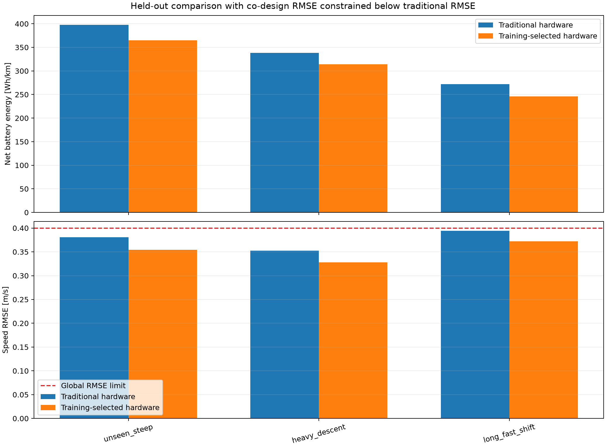

# Held-out matched-RMSE dominance test

!!! success "Lower error and lower energy in every test scenario"
    With a 40-point controller search, the training-selected hardware achieves lower RMSE and lower
    energy than traditional hardware on all three held-out scenarios.

## Why this additional test is stricter

The ordinary constrained comparison minimizes energy independently for both hardware designs under
the same global RMSE limit. A design can therefore use less energy while operating closer to that
limit. That is a valid constrained optimization result, but it does not visually demonstrate
dominance in both metrics.

This test imposes a scenario-specific second constraint:

1. Optimize the traditional hardware controller for minimum energy subject to RMSE ≤0.4 m/s.
2. Record the RMSE achieved by that optimized traditional controller.
3. Optimize the training-selected hardware controller for minimum energy subject to RMSE no greater
   than the traditional achieved RMSE on that same scenario.

The hardware remains fixed at the values selected before test evaluation:

- traditional: $g=10.5,s_m=0.60$;
- training-selected: $g=11.5,s_m=0.75$.

No test result changes either hardware design.

## Dense controller search

Each hardware/scenario pair receives the same 40-point controller grid:

$$
\log_{10}\lambda_E\in\{-2,-1.5,-1,-0.5,0,0.25,0.5,0.75\},
$$

$$
\log_{10}\lambda_{\Delta u}\in\{-2,-1.5,-1,-0.5,0\}.
$$

Across three scenarios and two hardware designs, the experiment contains 240 closed-loop
evaluations. All non-RMSE mission, station, thermal, completion, and fallback constraints remain
active.

## Results

| Scenario | Traditional RMSE | Selected RMSE | RMSE improvement | Traditional Wh/km | Selected Wh/km | Energy improvement |
|---|---:|---:|---:|---:|---:|---:|
| Unseen steep | 0.3804 | **0.3541** | 0.0263 | 397.86 | **364.99** | **8.26%** |
| Heavy descent | 0.3522 | **0.3278** | 0.0244 | 338.24 | **314.16** | **7.12%** |
| Long fast shift | 0.3943 | **0.3723** | 0.0219 | 272.03 | **245.91** | **9.60%** |
| **Mean energy** | — | — | — | **336.04** | **308.35** | **8.24%** |



The training-selected hardware strictly dominates the traditional hardware at the sampled
controller resolution: every orange energy bar and every orange RMSE bar is lower than its blue
counterpart.

The selected MPC parameters also differ by scenario, confirming that the controller remains
adaptable after hardware freezing:

| Scenario | Traditional $(\log_{10}\lambda_E,\log_{10}\lambda_{\Delta u})$ | Selected hardware $(\log_{10}\lambda_E,\log_{10}\lambda_{\Delta u})$ |
|---|---:|---:|
| Unseen steep | $(0,0)$ | $(-2,0)$ |
| Heavy descent | $(0,0)$ | $(-1.5,0)$ |
| Long fast shift | $(-1,0)$ | $(-2,-0.5)$ |

## Reproduce

```bash
codesign-matched-rmse-test
```

Outputs under `artifacts/matched_rmse_test/` include all cached evaluations, selected controllers,
the comparison CSV, plot, and machine-readable report.

Implementation: [`matched_rmse_test.py`](https://github.com/odetojsmith/Codesign-for-Cruise-Control/blob/main/src/codesign/matched_rmse_test.py).

## Interpretation boundary

This is stronger evidence than comparing only under a shared loose threshold, but it remains a
finite controller-grid result in the illustrative software model. A continuous optimizer could
move both designs closer to their true constrained optima. The measured margins are large enough
to survive the current grid, but sourced motor data and broader traffic/curvature validation remain
necessary.
