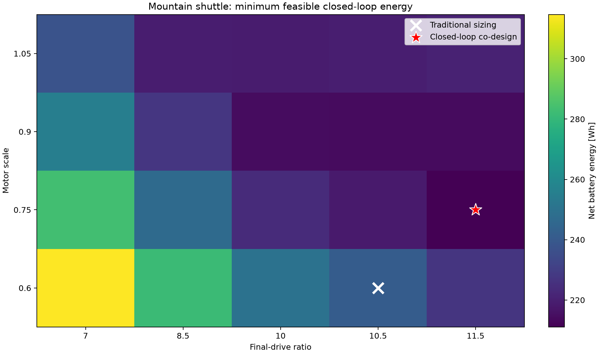
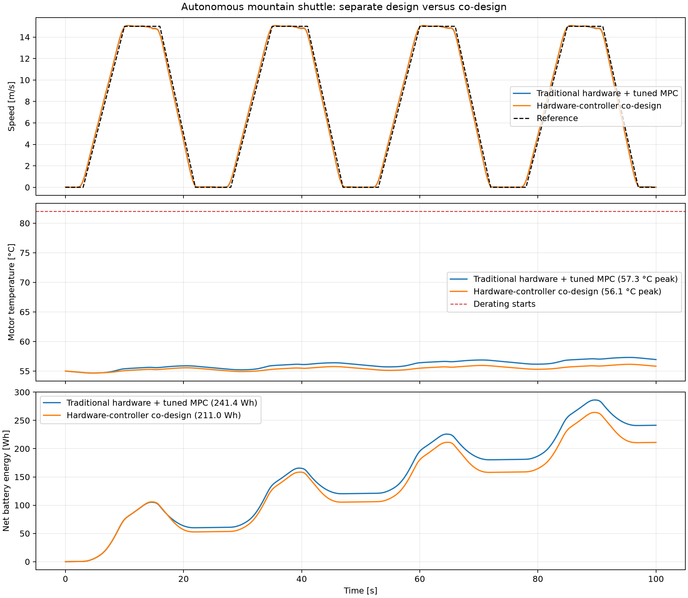

# Autonomous mountain-shuttle co-design

!!! success "Implemented and sampled in MetaDrive"
    A 60-point quick search found a 12.58% closed-loop energy improvement at essentially unchanged
    tracking quality. This is the first project scenario with a material separate-design versus
    co-design gap.

## Why this scenario exists

The earlier urban, highway, and ±6% grade episodes rarely activated a hardware limit. Once a
powertrain could deliver the MPC's 3 m/s² acceleration cap, larger motors and different ratios
produced almost identical tracking. The mountain shuttle instead repeats four uphill launches and
four downhill station stops, so wheel torque, motor operating point, regenerative capacity, and
battery charging power all influence the closed-loop result.

Research motivation is consistent with the implementation: [hilly-road NMPC](https://www.mdpi.com/2076-0825/13/4/144)
uses previewed slope information to generate an economical velocity trajectory, while an
[experimental single-speed drivetrain study](https://www.mdpi.com/2071-1050/12/21/9254)
shows that final-drive selection changes EV energy use.

## Mission and constraints

Each 25 s cycle contains a 3 s station dwell, a 0–15 m/s launch, uphill cruise, descent, braking to
zero, and another 3 s dwell. Four cycles give a 100 s, 750 m mission. Grade varies between +10% and
−10% and is previewed by the MPC.

| Requirement | Limit |
|---|---:|
| Speed RMSE | ≤0.75 m/s |
| Terminal progress | ≥98.5% of 750 m |
| Maximum station distance error | ≤12 m |
| Maximum station speed | ≤1.25 m/s |
| Battery discharge power | 90 kW |
| Battery charge power | 45 kW |
| Motor temperature | ≤112 °C |
| MPC fallback | None |

These are hard feasibility checks. Energy and RMSE are not collapsed into a weighted final score;
the experiment minimizes energy only among designs completing the same service.

## Added physical states

Battery power is capped in the actuator layer. During traction, the cap reduces available motor
torque. During braking, regeneration is capped first and the remaining requested force is supplied
by friction braking.

The optional lumped motor thermal state is

$$
C_{\mathrm{th}}\dot T=P_{\mathrm{loss}}-h(T-T_{\mathrm{amb}}).
$$

Thermal capacity scales with motor size, and available torque is linearly derated above the warning
temperature. Temperature did not become active in this 100 s quick run—the observed peaks were
57.30 °C and 56.14 °C—so the reported energy advantage is not caused by forced thermal failure.
Longer shift-level validation can activate this constraint.

## Separate design versus co-design

The traditional path first applies backward-cycle energy, 120 km/h top speed, 0–100 km/h time, and
20% gradeability checks without feedback-control metrics. It selected $g=10.5$, $s_m=0.6$; only
after freezing that hardware was its MPC tuned.

Co-design sampled final-drive ratio, motor scale, and MPC weights together under the mountain
mission constraints.

| Result | Traditional + tuned MPC | Co-design |
|---|---:|---:|
| Final-drive ratio | 10.5 | **11.5** |
| Motor scale | 0.60 | **0.75** |
| Speed RMSE | 0.4182 m/s | **0.4177 m/s** |
| Distance | 750.007 m | 750.024 m |
| Net battery energy | 241.40 Wh | **211.03 Wh** |
| Friction-brake energy | 60.21 Wh | **28.02 Wh** |
| Recovered battery energy | 181.02 Wh | **212.99 Wh** |
| Energy improvement | — | **12.58%** |

The main mechanism is visible: the co-designed ratio and motor recover approximately 32 Wh more
energy and dissipate approximately 32 Wh less through friction braking while following effectively
the same trajectory.



Across sampled hardware, minimum feasible energy ranged from 314.7 Wh at $g=7,s_m=0.6$ to 211.0 Wh
at $g=11.5,s_m=0.75$. The optimum is interior in motor scale: increasing scale to 0.9 or 1.05 adds
mass after useful regeneration has reached the battery charge-power ceiling.



## Reproduce

```bash
codesign-mountain-shuttle --quick
```

Outputs include the complete CSV grid, both selected trajectories, JSON report, hardware map, and
time-history comparison in `artifacts/mountain_shuttle/`.

Implementation: [`mountain_shuttle.py`](https://github.com/odetojsmith/Codesign-for-Cruise-Control/blob/main/src/codesign/mountain_shuttle.py).

## Interpretation boundary

This is software-in-the-loop evidence using an illustrative motor efficiency map and an
illustrative lumped thermal model. The qualitative mechanism and closed-loop comparison are valid
inside the model; absolute energy and temperature values require a sourced motor map, calibrated
thermal parameters, unseen-seed/vehicle-parameter tests, and later CARLA validation.
