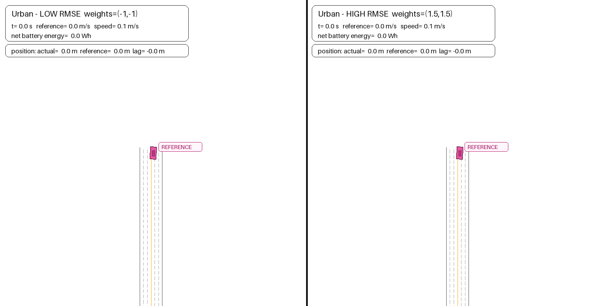
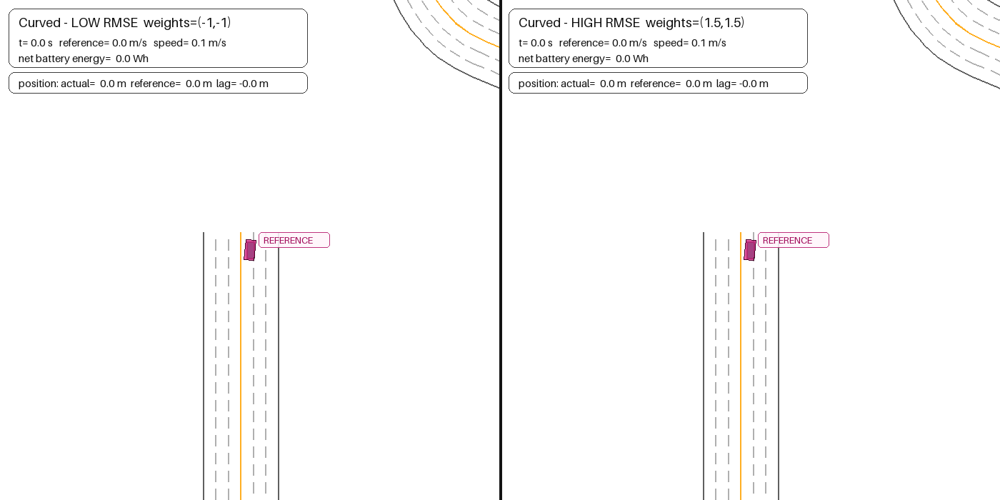

# MPC weight sampling and Pareto frontier

The first live weight sweep measures how much controller performance remains available beyond the
initial default. It samples

$$
\log_{10}\lambda_E,\log_{10}\lambda_{\Delta F}
\in\{-3,-1,0,1.5,3\},
$$

for 25 combinations. Every combination runs both the urban stop–go and curved-road MetaDrive
episodes. Aggregate RMSE is calculated over every trajectory point; net battery energy is summed
across both episodes.

## Feasibility filter

A sampled point is eligible for the frontier only if both episodes complete and satisfy:

- peak acceleration no greater than 3.05 m/s²;
- measured peak jerk no greater than 4 m/s³;
- maximum lateral error below 1.75 m;
- no MPC fallback.

The no-lead tuning scenarios do not filter on numerical gap slack because their gap state is
inactive. Actual gap behavior is tested separately in the braking validation.

## Test-scenario animations

Each split-screen animation compares the low-RMSE MPC $(-1,-1)$ on the left with the
energy-oriented, high-RMSE MPC $(1.5,1.5)$ on the right. Both sides use the same scenario, initial
condition, curvature-aware speed planner, and fixed lateral controller. The overlay reports the
actual closed-loop reference, speed, and cumulative net battery energy. A magenta **REFERENCE**
vehicle moves directly on the rendered route at the commanded route position. A faint line connects
the physical vehicle to its reference ghost, making longitudinal lag visible even when both remain
centered on the curved road.

| Urban stop–go | Curved route |
|:---:|:---:|
|  |  |

| Scenario | Controller | Speed RMSE | Net energy | Distance |
|---|---|---:|---:|---:|
| Urban | Low RMSE $(-1,-1)$ | 0.218 m/s | 44.43 Wh | 325.38 m |
| Urban | High RMSE $(1.5,1.5)$ | 1.285 m/s | 35.76 Wh | 278.61 m |
| Curved | Low RMSE $(-1,-1)$ | 0.189 m/s | 48.72 Wh | 321.08 m |
| Curved | High RMSE $(1.5,1.5)$ | 1.521 m/s | 35.01 Wh | 274.08 m |

The urban case exercises acceleration, cruising, full stopping, regeneration, dwell, and restart.
The curved case exercises curvature-aware speed planning and coordination with the fixed lateral
PID plus steering feedforward.

### Reference-position definition

The reference ghost is not another physical vehicle and does not interact with MetaDrive dynamics.
Its route distance is obtained by integrating the speed reference actually passed to each MPC after
curvature-aware planning:

$$
s_{\mathrm{ref},k}=\sum_{i=0}^{k}v_{\mathrm{ref},i}\Delta t.
$$

The ghost's world coordinates and heading are interpolated along the low-RMSE rollout's sampled
route geometry at $s_{\mathrm{ref},k}$. The physical vehicle uses MetaDrive's accumulated planar
travel distance $s_k$. The displayed lag is $s_{\mathrm{ref},k}-s_k$: positive values mean the
physical vehicle is behind its commanded route position. The renderer's own pixels-per-meter scale
places the ghost in the same moving camera frame as the real vehicle.


The left panel shows the entire sampled range. The right panel expands the practically relevant
tracking region. Marker color is $\log_{10}\lambda_E$ and marker size increases with
$\log_{10}\lambda_{\Delta F}$. Labels on the frontier are `(energy log-weight, slew log-weight)`.

## What the sweep says

| Selection rule | Weights $(\log_{10}\lambda_E,\log_{10}\lambda_{\Delta F})$ | Aggregate RMSE | Total energy | Change from default |
|---|---:|---:|---:|---:|
| Current default | $(0,-1)$ | 0.221 m/s | 93.07 Wh | — |
| Lower RMSE and energy | $(-1,-1)$ | 0.206 m/s | 92.85 Wh | −0.23% energy |
| Minimum energy with RMSE $\leq0.8$ | $(1.5,-1)$ | 0.694 m/s | 83.29 Wh | −10.51% energy |
| Minimum energy with RMSE $\leq1.5$ | $(1.5,1.5)$ | 1.383 m/s | 70.82 Wh | −23.90% energy |

The default is good but not nondominated: $(-1,-1)$ is slightly better in both aggregate RMSE and
energy. More meaningful energy savings require relaxing the external tracking constraint. This is
exactly why final controller and co-design comparisons must select minimum energy at a fixed RMSE
bound rather than compare internal weighted costs.

Very low slew weights can reduce RMSE further but violate measured jerk. Very high energy or slew
weights save energy mainly by refusing to follow the requested speed; those points are visible on
the full plot but are ineligible under practical RMSE bounds.

## Animated trajectory comparison

The animation compares the low-RMSE point $(-1,-1)$ with the energy-oriented, high-RMSE point
$(1.5,1.5)$ on the same urban reference. It synchronizes road progress, speed, requested force, and
cumulative battery energy.

| Controller | Urban RMSE | Net energy | Distance |
|---|---:|---:|---:|
| Low RMSE $(-1,-1)$ | 0.218 m/s | 44.43 Wh | 325.38 m |
| High RMSE $(1.5,1.5)$ | 1.285 m/s | 35.76 Wh | 278.61 m |

The high-RMSE controller saves energy by accepting slower acceleration and larger tracking errors;
it also travels 46.77 m less during the fixed-time task. The moving road markers make that
consequence visible instead of presenting energy reduction by itself.


## Reproduction

```bash
codesign-mpc-sweep
codesign-trajectory-animation
codesign-scenario-gifs
codesign-scenario-comparison-gifs
```

The command writes the complete CSV, JSON summary, and Pareto plot to `artifacts/mpc_sweep/`.
