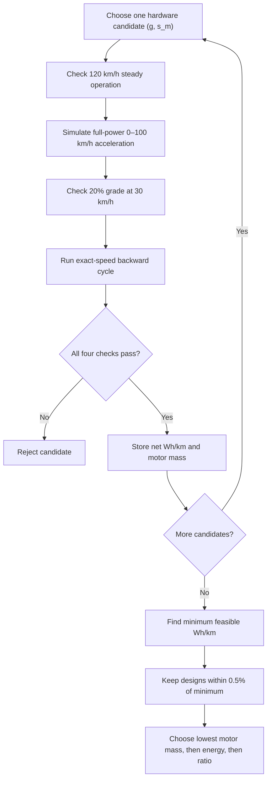
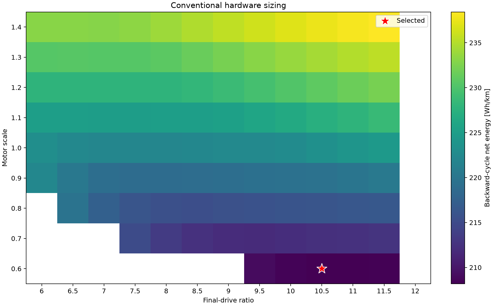

# Conventional separate design

!!! success "Implemented"
    Backward-facing hardware sizing, persistent evaluation caching, and frozen-hardware MPC tuning
    are implemented. The current evidence uses the quick controller grid; the full grid remains to
    be run.

## Purpose

Represent a conventional engineering sequence in which hardware is sized from performance and
drive-cycle requirements without closed-loop tracking metrics, then the controller is tuned after
hardware is frozen.

## Stage 1 — hardware sizing

### Candidate grid

The traditional hardware search evaluates the Cartesian product

$$
g\in\{6,6.5,\ldots,12\},\qquad
s_m\in\{0.6,0.7,\ldots,1.4\}.
$$

There are $13\times9=117$ candidates. For each candidate, the scaled physical properties are

$$
\begin{aligned}
m &= 1500+75s_m,\\
T_{\mathrm{peak}} &=300s_m,\\
P_{\mathrm{peak}} &=150s_m\ \mathrm{kW},
\end{aligned}
$$

while maximum motor speed remains 12,000 rpm.

### Overall algorithm



The four checks below are performed without a feedback controller.

### Check 1 — 120 km/h steady operation

At

$$
v_{\mathrm{top}}=120/3.6=33.333\ \mathrm{m/s},
$$

calculate motor speed and available torque:

$$
\omega_m=\frac{gv_{\mathrm{top}}}{r_w},\qquad
T_{\mathrm{allow}}=\min\left(T_{\mathrm{peak}},
\frac{P_{\mathrm{peak}}}{\omega_m}\right).
$$

Available wheel traction is

$$
F_{\mathrm{traction,max}}
=\frac{T_{\mathrm{allow}}g\eta_g}{r_w}.
$$

The candidate passes only if

$$
\omega_m\leq\omega_{m,\max}
\quad\text{and}\quad
F_{\mathrm{traction,max}}\geq F_{\mathrm{road}}(v_{\mathrm{top}},0).
$$

This tests both motor overspeed and whether the vehicle can overcome rolling and aerodynamic drag;
merely having a theoretical motor speed below 12,000 rpm is not sufficient.

### Check 2 — full-power 0–100 km/h acceleration

Starting from rest, the sizing code requests maximum available traction on a flat road and advances
speed with a 0.02 s integration step:

$$
v_{k+1}=v_k+\frac{F_{\mathrm{traction,max}}(v_k)-F_{\mathrm{road}}(v_k,0)}{m}\Delta t.
$$

Motor torque limits dominate at low speed and motor power limits dominate at higher speed. The
candidate passes if it reaches 27.778 m/s within 10 s. This is a plant-capability simulation, not a
controller-tracking experiment; jerk and comfort are deliberately absent.

### Check 3 — 20% gradeability at 30 km/h

At $v=30/3.6=8.333$ m/s and signed grade $q=0.20$, calculate

$$
F_{\mathrm{road}}=mgC_{rr}\cos(\tan^{-1}q)
+\frac12\rho C_dAv^2
+mg\sin(\tan^{-1}q).
$$

The candidate passes if available wheel traction at that speed is at least this road load. This is
a steady-speed requirement; there is no required acceleration margin beyond holding 30 km/h.

### Check 4 — backward-facing exact-speed cycle

The ranking cycle is fixed and short:

| Time [s] | 0 | 3 | 8 | 12 | 16 |
|---:|---:|---:|---:|---:|---:|
| Prescribed speed [m/s] | 0 | 8 | 14 | 14 | 8 |

Road grade is interpolated by accumulated reference distance:

| Distance [m] | 0 | 25 | 55 | 85 | 120 | 180 |
|---:|---:|---:|---:|---:|---:|---:|
| Grade | 0% | +6% | −4% | +3% | −6% | 0% |

The profile is sampled every 0.2 s. Reference acceleration is computed numerically, and required
wheel force at every sample is

$$
F_{\mathrm{required},k}=ma_k+F_{\mathrm{road}}(v_k,q_k).
$$

The force is passed through the same motor torque, power, speed, final-drive, regeneration, and
friction-brake model used in closed-loop simulation. If positive required force exceeds delivered
force, or positive traction is requested beyond maximum motor speed, the cycle is infeasible.

For feasible samples, motor speed is $\omega_{m,k}=gv_k/r_w$. Motor torque uses the appropriate
driveline direction:

$$
T_{m,k}=\frac{F_{w,k}r_w}{\eta_gg}\quad\text{during motoring},
$$

$$
T_{m,k}=\frac{F_{regen,k}r_w\eta_g}{g}\quad\text{during regeneration}.
$$

The interpolated efficiency map then gives battery power. During motoring,

$$
P_{b,k}=\frac{T_{m,k}\omega_{m,k}}{\eta_{m,k}\eta_{inv}}+P_{aux};
$$

during regeneration the efficiency direction is reversed. Energy and distance are

$$
E_{net}=\sum_kP_{b,k}\frac{\Delta t}{3600},\qquad
d=\sum_kv_k\Delta t,
$$

so the ranking value is

$$
e=\frac{E_{net}}{d/1000}\quad[\mathrm{Wh/km}].
$$

The phrase *backward-facing* means speed is imposed first and force is calculated backward from
that trajectory. No controller is asked to produce the trajectory, and no tracking RMSE appears.
The default conventional run has no battery charge/discharge power cap and has thermal derating
disabled; motor torque, motor power, motor speed, driveline efficiency, regeneration fraction, and
the efficiency map remain active.

### Feasibility and selection rule

The vehicle-level requirements are:

| Requirement | Threshold |
|---|---:|
| Maximum speed | At least 120 km/h |
| 0–100 km/h acceleration | At most 10 s |
| Gradeability | 20% at 30 km/h |

All four Boolean checks must pass:

$$
\text{feasible}=\text{top-speed pass}\land\text{acceleration pass}
\land\text{grade pass}\land\text{cycle pass}.
$$

The code then:

1. finds the minimum feasible cycle energy $e_{min}$;
2. keeps every feasible candidate with $e\leq1.005e_{min}$;
3. chooses the lowest motor mass;
4. if mass ties, chooses lower cycle energy;
5. if energy also ties, chooses lower final-drive ratio.

Thus the rule is not simply “choose the absolute minimum energy.” It permits up to 0.5% more cycle
energy to avoid a heavier motor. For the current data, however, the absolute energy minimum is also
the selected design.

No feedback-controller tracking error is used in this stage.

## Numerical trace for the selected hardware

The grid retains 97 of 117 candidates. For $g=10.5,s_m=0.6$:

| Derived quantity | Value |
|---|---:|
| Total vehicle mass | 1545 kg |
| Motor mass | 45 kg |
| Peak motor torque | 180 N·m |
| Peak motor power | 90 kW |
| Motor speed at 120 km/h | 10,781 rpm |
| Available traction at 120 km/h | 2619 N |
| Road load at 120 km/h | 636 N |
| Top-speed traction margin | 1983 N |
| Available traction at 30 km/h, 20% grade | 5914 N |
| Road load at 30 km/h, 20% grade | 3178 N |
| Gradeability traction margin | 2736 N |
| Simulated 0–100 km/h time | 9.44 s |
| Cycle distance | 167.8 m |
| Cycle net battery energy | 34.933 Wh |
| Cycle energy intensity | 208.183 Wh/km |
| Maximum cycle motor speed | 4528 rpm |
| Maximum cycle motor torque | 144.02 N·m |

The 4528 rpm value is the maximum on the 0–14 m/s ranking cycle; it is **not** the separate
120 km/h check, where motor speed is 10,781 rpm.

The minimum cycle energy is 208.1829 Wh/km, so the 0.5% near-minimum threshold is
209.2238 Wh/km. Five candidates survive this final preference set:

| $g$ | $s_m$ | Motor mass | Wh/km | 0–100 km/h |
|---:|---:|---:|---:|---:|
| **10.5** | **0.6** | **45.0 kg** | **208.183** | **9.44 s** |
| 11.0 | 0.6 | 45.0 kg | 208.210 | 9.26 s |
| 11.5 | 0.6 | 45.0 kg | 208.408 | 9.10 s |
| 10.0 | 0.6 | 45.0 kg | 208.492 | 9.66 s |
| 9.5 | 0.6 | 45.0 kg | 209.074 | 9.92 s |

All five have the same motor mass, so energy breaks the tie and selects $g=10.5,s_m=0.6$.

## What this traditional calculation does not know

The hardware stage does not evaluate:

- closed-loop speed tracking or MPC saturation;
- station arrival error or route completion under feedback;
- predictive grade handling;
- repeated downhill regenerative opportunities under a battery charge-power cap;
- controller-specific friction-brake avoidance;
- the train/test mission distribution.

Those omissions define the intended traditional baseline. They also explain how hardware that is
best for the exact prescribed cycle can be suboptimal after controller performance is included.

## Stage 2 — controller tuning

Freeze selected hardware. For every externally specified tracking limit $\epsilon$, tune controller
parameters to solve

$$
\min_\theta E_{\mathrm{net}}(h_{\mathrm{sep}},\theta)
\quad\text{subject to}\quad
\operatorname{RMSE}_v\leq\epsilon.
$$

## Final comparison

Evaluate separate design and co-design with identical scenarios, seeds, constraints, and metrics.
The claim is only supported where co-design uses less energy at the same tracking bound without
additional safety or comfort violations.

## Outputs

- selected conventional hardware;
- hardware-feasibility map;
- backward-facing Wh/km table;
- best controller at each RMSE bound;
- separate-design Pareto points;
- validation trajectories.

## Current quick result

The 117-point hardware grid has 97 feasible candidates. The conventional rule selects
$g=10.5$ and $s_m=0.6$:

| Quantity | Result |
|---|---:|
| Motor mass | 45.0 kg |
| Backward-cycle energy | 208.18 Wh/km |
| 0–100 km/h time | 9.44 s |
| 120 km/h requirement | Pass |
| 20% grade at 30 km/h | Pass |



The quick closed-loop controller sweep finds no feasible point at 0.1 or 0.2 m/s aggregate RMSE.
At the 0.4 and 0.8 m/s bounds, the selected controller is $(0,0)$ with 0.268 m/s RMSE and
162.69 Wh across the shared urban, highway, and grade training episodes.

```bash
codesign-size-hardware
codesign-separate-opt --quick
```
