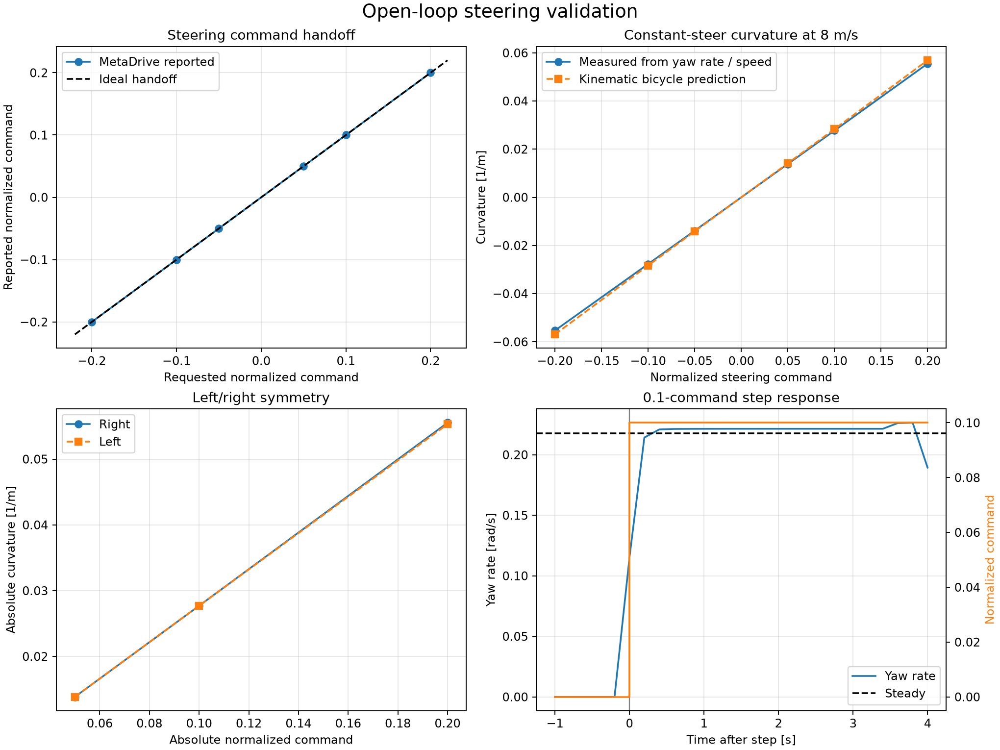

# Actuator validation methods

This page separates two questions that were previously grouped under the broad label “actuator
calibration”:

1. Does the longitudinal EV layer deliver its requested signed wheel force to the MetaDrive
   chassis?
2. Does a normalized steering command reach MetaDrive correctly and produce a plausible,
   symmetric vehicle response?

These are software-in-the-loop checks. “Measured” below means measured from the simulated chassis,
not from a physical vehicle or a tire-force sensor.

## Longitudinal signed-force calibration

### Test boundary

The input is requested wheel force in newtons. It passes through the hardware-dependent EV model,
which applies torque, power, motor-speed, and regenerative limits, and is then normalized for
MetaDrive. The output used for calibration is the MetaDrive chassis speed history.

The test uses a flat, straight, traffic-free road and zero steering. At each hardware configuration,
the MetaDrive chassis mass equals base vehicle mass plus scaled motor mass.

### Traction procedure

For each of 25%, 50%, 75%, and 100% of the zero-speed traction limit:

1. Reset the vehicle from rest.
2. Apply a constant positive wheel-force request for 3 s.
3. Discard the first 0.6 s to remove launch transients.
4. Fit a straight line to speed versus time; its slope is measured acceleration.
5. Convert the acceleration to chassis-equivalent force.

$$
a_{\mathrm{fit}}=\frac{d v_{\mathrm{MD}}}{dt}, \qquad
F_{\mathrm{equiv}}=m_{\mathrm{chassis}}a_{\mathrm{fit}}, \qquad
G_F=\frac{F_{\mathrm{equiv}}}{F_{\mathrm{requested}}}.
$$

### Regenerative-braking procedure

The same four fractions are tested with negative force. Each run first accelerates to 12 m/s, then
applies the constant regenerative request for up to 2 s. The speed slope is fitted until the test
window ends or speed falls below 0.5 m/s. A correct signed actuator has negative acceleration,
negative equivalent force, and a positive gain near one.

### Acceptance and interpretation

The automated requirement is

$$
\max_i |G_{F,i}-1| < 0.001.
$$

The current worst error is $9.72\times10^{-5}$, or 0.00972%. This supports the claim that the EV
layer's signed force reaches the current MetaDrive chassis with the intended magnitude.

!!! warning "What this does not prove"
    $m a$ is net chassis-equivalent force, not a direct tire-contact-force measurement. The result
    is meaningful here because the calibration road is flat and the current MetaDrive setup does
    not include the project-owned aerodynamic, rolling-resistance, or grade forces. If those loads
    are introduced, they must be estimated and added back before comparing traction force. This
    check also does not establish real-vehicle fidelity.

## Open-loop steering validation

Closed-loop centerline tracking is retained as a system-level test, but it is not treated as
steering calibration: a PID controller can compensate for some actuator errors. Steering therefore
has a separate open-loop validation.

### Signals exposed by the wrapper

For every step, the wrapper can now report:

- requested normalized steering $u_\delta\in[-1,1]$;
- normalized steering stored by MetaDrive after action processing;
- front-wheel angle sent by MetaDrive to Bullet, $\delta=u_\delta\delta_{\max}$;
- chassis heading, speed, position, and vehicle wheelbase.

The deterministic configuration uses $\delta_{\max}=40^\circ$.

### Constant-steer sweep

The longitudinal speed loop first settles the vehicle at 8 m/s. Steering is then open loop: no
lateral or heading controller is active. The sweep commands are

$$
u_\delta\in\{-0.20,-0.10,-0.05,0.05,0.10,0.20\},
$$

equivalent to wheel-angle requests of $\{-8,-4,-2,2,4,8\}^\circ$. Each command is held for 3 s and
the first 1 s is discarded. Road-boundary termination is disabled for this diagnostic so leaving
the lane does not truncate a constant-turn test; vehicle physics remains active.

Yaw rate is obtained from the wrapped heading difference at the 0.2 s control interval. Measured
curvature and the low-speed kinematic-bicycle reference are

$$
\dot\psi_k=\frac{\operatorname{wrap}(\psi_k-\psi_{k-1})}{\Delta t}, \qquad
\kappa_{\mathrm{measured}}=\frac{\overline{\dot\psi}}{\overline v}, \qquad
\kappa_{\mathrm{bicycle}}=\frac{\tan\delta}{L}.
$$

The effective steering angle inferred independently from chassis motion is

$$
\delta_{\mathrm{effective}}=\tan^{-1}(L\kappa_{\mathrm{measured}}).
$$

The automated checks require exact normalized-command handoff, correct turn sign, monotonically
increasing curvature magnitude, less than 2% left/right curvature asymmetry, and less than 10%
relative error from the bicycle reference. Current results have 0 command-handoff error, 0.387%
worst left/right asymmetry, and 2.83% worst bicycle-reference error.

### Step-steer response

At 8 m/s, the vehicle runs straight for 1 s and then receives a $u_\delta=0.10$ ($4^\circ$) step for
4 s. The final 1 s estimates steady yaw rate. Response delay is the first 10% crossing; rise time is
the interval from 10% to 90% of steady yaw rate.

The current measured delay is 0 s at the sampled control boundary and rise time is 0.2 s. The
acceptance limits are one control interval for delay and 0.6 s for rise time. Because measurements
are sampled every 0.2 s, “0 s delay” means response was visible in the first post-command sample; it
does not claim zero physical latency.



## Reproduction and artifacts

Run the complete check with:

```bash
python -m codesign.validation_cli
```

It produces `actuator_calibration.json`, `steering_validation.json`,
`steering_validation.png`, and the combined validation report under `artifacts/validation/`.
Implementation is in `calibration.py`, `steering_validation.py`, `metadrive_env.py`, and
`validation_cli.py`.
