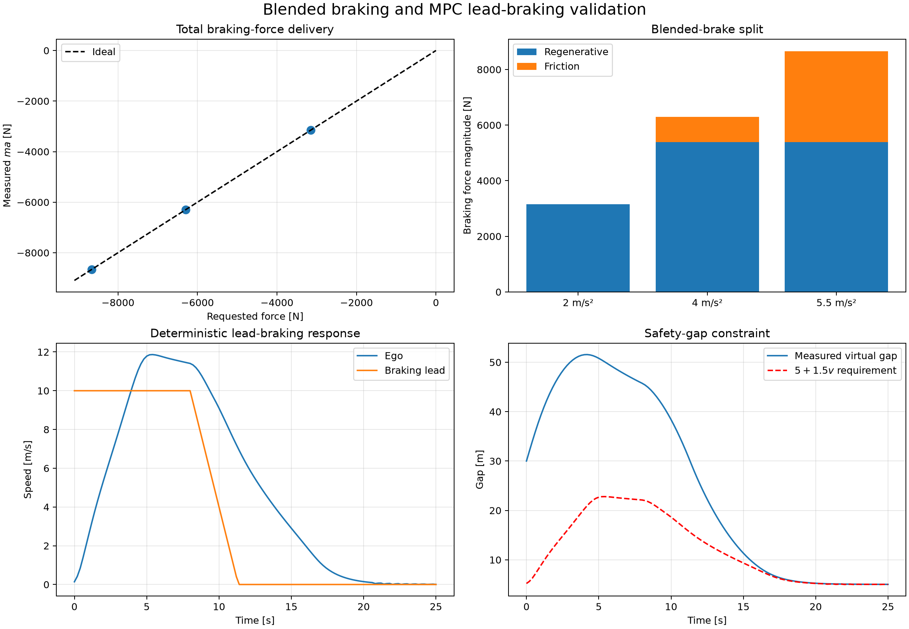

# Braking validation

Braking validation covers both the actuator split and the MPC response to a braking lead vehicle.

## Blended-brake actuator

The ego vehicle accelerates to 15 m/s on a flat, straight road, then receives total braking
requests corresponding to 2, 4, and 5.5 m/s². Chassis-equivalent force is reconstructed from the
MetaDrive speed slope:

$$
F_{\mathrm{measured}}=m\frac{dv}{dt}.
$$

Regeneration is used first. Friction braking supplies only the force beyond the motor's current
regenerative limit and does not contribute to recovered battery energy.

| Requested deceleration | Total force | Regenerative force | Friction force | Relative force error |
|---:|---:|---:|---:|---:|
| 2.0 m/s² | −3150.0 N | −3150.0 N | 0.0 N | 0.00229% |
| 4.0 m/s² | −6300.0 N | −5387.4 N | −912.6 N | 0.00229% |
| 5.5 m/s² | −8662.5 N | −5387.4 N | −3275.1 N | 0.00055% |

## Deterministic lead braking

The ego uses live MetaDrive chassis dynamics on a straight road. A deterministic kinematic lead
starts 30 m ahead at 10 m/s and brakes at 3 m/s² from 8 s until stopped. The MPC uses the same
bounded-braking assumption over its prediction horizon.

The result completes without fallback, applies a minimum requested force of −2528.5 N, and keeps
the gap positive. Minimum gap is 5.027 m and the smallest margin over
$d_{\mathrm{safe}}=5+1.5v$ is 0.002 m. Measured peak deceleration is 1.605 m/s² and peak jerk is
3.500 m/s³.

!!! note "Scope"
    The ego physics and braking actuator are live MetaDrive. The lead is deterministic and
    kinematic rather than a rendered MetaDrive traffic actor. This isolates gap prediction and MPC
    braking reproducibly; a physical traffic-actor transfer test remains useful later.



## Reproduction

```bash
codesign-braking-validate
```

The command fails on force-delivery error, missing friction blending, collision, safety-gap
violation, missing MPC braking, fallback, or incomplete execution.
