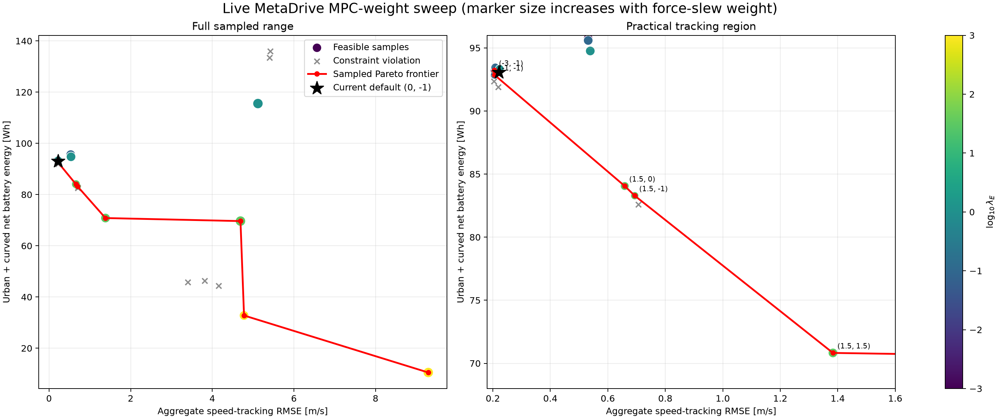

# Validation evidence

## What has been established

The validation suite addresses three different questions:

1. Does MetaDrive apply the requested feasible wheel force?
2. Does the energy layer conserve the modeled power flow and integrate correctly?
3. Can simple controllers complete representative routes while remaining inside the lane?

It does not establish that the synthetic efficiency map matches a production motor.

## Automated acceptance checks

`python -m codesign.validation_cli` fails unless all checks pass:

| Check | Acceptance threshold | Current result |
|---|---:|---:|
| Maximum actuator relative error | <0.1% | 0.0097% |
| Curved-track completion | Required | Passed |
| Lane containment | $|e_y|<1.75$ m | Passed |
| Urban completion | Required | Passed |
| Energy integration residual | < $10^{-9}$ Wh | 0 Wh |
| Driveline power residual | < $10^{-6}$ W | $1.1\times10^{-11}$ W |

## Longitudinal actuator calibration

The vehicle is run at 25%, 50%, 75%, and 100% of traction and regenerative limits. Measured force
is computed independently from MetaDrive chassis acceleration:

$$
F_{\mathrm{measured}}=m_{\mathrm{chassis}}a.
$$

All eight points lie on $F_{\mathrm{measured}}=F_{\mathrm{requested}}$ within 0.01%.

The complete procedure, assumptions, and interpretation limits are documented in
[Actuator validation methods](actuator-validation.md).

## Open-loop steering validation

Steering is now checked independently of the lateral PID. A constant-steer sweep at 8 m/s verifies
normalized-command handoff, turn sign, curvature monotonicity, left/right symmetry, and agreement
with a kinematic-bicycle reference. A 0.1-command step characterizes yaw-rate delay and rise time.

| Steering check | Requirement | Result |
|---|---:|---:|
| Command handoff error | $<10^{-12}$ | 0 |
| Worst left/right curvature asymmetry | $<2\%$ | 0.387% |
| Worst bicycle-curvature relative error | $<10\%$ | 2.83% |
| Response delay | $\leq0.2$ s | 0 s sampled |
| 10–90% rise time | $\leq0.6$ s | 0.2 s |

## Energy consistency

For every trajectory point, validation reconstructs motor mechanical power from wheel force and
driveline efficiency, then reconstructs battery power from motor efficiency, inverter efficiency,
and auxiliary load. The reconstructed power is integrated independently and compared with the
reported episode energy.

Current centerline and urban runs both close with 0 Wh residual.

## PID route results

| Scenario | Speed RMSE | Lateral RMSE | Maximum lateral error | Distance | Completed |
|---|---:|---:|---:|---:|---|
| Curved centerline | 0.894 m/s | 0.307 m | 1.000 m | 320.70 m | Yes |
| Urban stop-go | 1.090 m/s | 0.120 m | 0.500 m | 322.84 m | Yes |

## Initial longitudinal MPC results

The MPC uses the same curvature-aware reference and fixed lateral controller as the PID baseline.
The current default weights are implementation-validation settings, not optimized values.

| Scenario | RMSE | Net energy | Peak acceleration | Peak jerk | Solver fallback |
|---|---:|---:|---:|---:|---:|
| Urban PID | 1.090 m/s | 47.64 Wh | 2.199 m/s² | 3.028 m/s³ | N/A |
| Urban MPC | 0.232 m/s | 44.09 Wh | 2.463 m/s² | 3.500 m/s³ | 0/221 |
| Curved MPC | 0.202 m/s | 48.47 Wh | 3.004 m/s² | 3.500 m/s³ | 0/151 |

## MPC-weight Pareto sweep

A 25-point live MetaDrive sweep found that the initial default is close to, but not on, the sampled
Pareto frontier. Changing log-weights from $(0,-1)$ to $(-1,-1)$ improves aggregate RMSE from
0.221 to 0.206 m/s and reduces two-scenario energy from 93.07 to 92.85 Wh. At an external RMSE
limit of 0.8 m/s, $(1.5,-1)$ uses 83.29 Wh, a 10.51% reduction from the default.

See [MPC weight sampling](../optimization/mpc-tuning.md) for the complete interpretation.

## Blended and lead braking

Total braking-force delivery passes within 0.0023% at 2, 4, and 5.5 m/s² requests. The 2 m/s²
case is regeneration-only; stronger requests add friction force without crediting it as recovered
energy. In the deterministic 3 m/s² lead-braking episode, MPC completes with no fallback, maintains
a positive gap, and keeps a minimum 0.002 m margin over $5+1.5v$.

## Visual dashboard

## Top-down centerline run

## Interpretation

### Supported claims

- hardware force limits are delivered to the MetaDrive chassis correctly;
- signed regenerative force is linear and calibrated;
- steering command handoff and open-loop chassis response pass deterministic checks;
- modeled driveline and battery power are numerically self-consistent;
- longitudinal and lateral observations support stable closed-loop driving;
- trajectories and metrics are reproducible under fixed seeds.
- the initial longitudinal MPC completes urban and curved-route scenarios without solver fallback;

### Unsupported until additional data

- production-vehicle Wh/km accuracy;
- real motor/inverter efficiency;
- battery thermal and degradation behavior;
- optimized MPC weights or co-design superiority;
- safety transfer to a rendered, physically controlled traffic actor;
- transfer equivalence between MetaDrive and CARLA;
- superior co-design results before optimization is implemented.

## Source and raw outputs

- Validation implementation: [`validation_cli.py`](https://github.com/odetojsmith/Codesign-for-Cruise-Control/blob/main/src/codesign/validation_cli.py)
- Actuator calibration: [`calibration.py`](https://github.com/odetojsmith/Codesign-for-Cruise-Control/blob/main/src/codesign/calibration.py)
- Test suite: [`tests/`](https://github.com/odetojsmith/Codesign-for-Cruise-Control/tree/main/tests)
