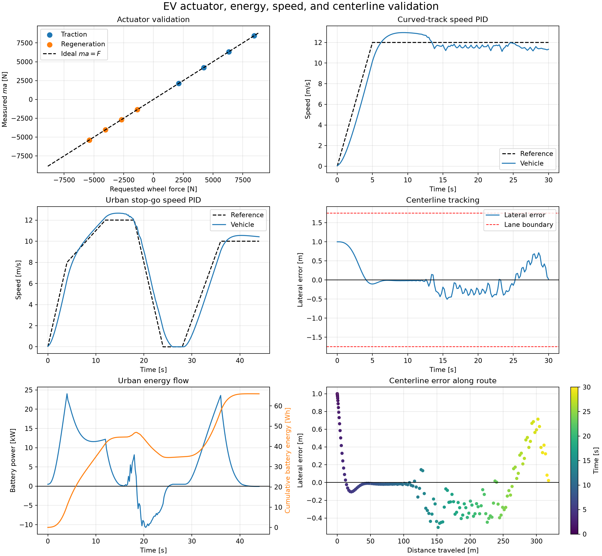
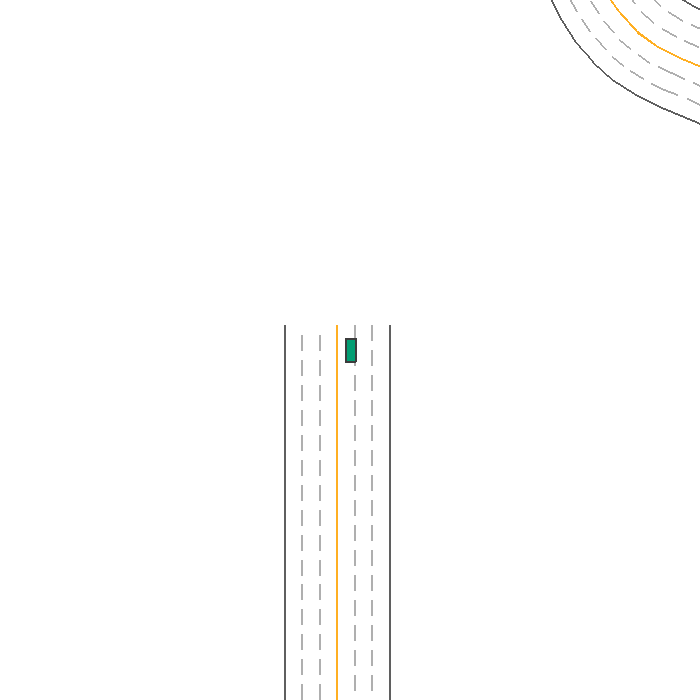

# Validation evidence

## What has been established

The validation suite addresses three different questions:

1. Does MetaDrive apply the requested feasible wheel force?
2. Does the energy layer conserve the modeled power flow and integrate correctly?
3. Can simple controllers complete representative routes while remaining inside the lane?

It does not establish that the synthetic efficiency map matches a production motor.

## Automated acceptance checks

`python -m codesign.validation_cli` fails unless all checks pass:

| Check | Acceptance threshold | Current result |
|---|---:|---:|
| Maximum actuator relative error | <0.1% | 0.0097% |
| Curved-track completion | Required | Passed |
| Lane containment | $|e_y|<1.75$ m | Passed |
| Urban completion | Required | Passed |
| Energy integration residual | < $10^{-9}$ Wh | 0 Wh |
| Driveline power residual | < $10^{-6}$ W | $1.1\times10^{-11}$ W |

## Actuator calibration

The vehicle is run at 25%, 50%, 75%, and 100% of traction and regenerative limits. Measured force
is computed independently from MetaDrive chassis acceleration:

$$
F_{\mathrm{measured}}=m_{\mathrm{chassis}}a.
$$

All eight points lie on $F_{\mathrm{measured}}=F_{\mathrm{requested}}$ within 0.01%.

## Energy consistency

For every trajectory point, validation reconstructs motor mechanical power from wheel force and
driveline efficiency, then reconstructs battery power from motor efficiency, inverter efficiency,
and auxiliary load. The reconstructed power is integrated independently and compared with the
reported episode energy.

Current centerline and urban runs both close with 0 Wh residual.

## PID route results

| Scenario | Speed RMSE | Lateral RMSE | Maximum lateral error | Distance | Completed |
|---|---:|---:|---:|---:|---|
| Curved centerline | 0.909 m/s | 0.377 m | 1.000 m | 318.19 m | Yes |
| Urban stop-go | 0.894 m/s | 0.162 m | 0.597 m | 321.96 m | Yes |

## Visual dashboard

## Top-down centerline run

## Interpretation

### Supported claims

- hardware force limits are delivered to the MetaDrive chassis correctly;
- signed regenerative force is linear and calibrated;
- modeled driveline and battery power are numerically self-consistent;
- longitudinal and lateral observations support stable closed-loop driving;
- trajectories and metrics are reproducible under fixed seeds.

### Unsupported until additional data

- production-vehicle Wh/km accuracy;
- real motor/inverter efficiency;
- battery thermal and degradation behavior;
- transfer equivalence between MetaDrive and CARLA;
- superior co-design results before optimization is implemented.

## Source and raw outputs

- Validation implementation: [`validation_cli.py`](https://github.com/odetojsmith/Codesign-for-Cruise-Control/blob/main/src/codesign/validation_cli.py)
- Actuator calibration: [`calibration.py`](https://github.com/odetojsmith/Codesign-for-Cruise-Control/blob/main/src/codesign/calibration.py)
- Test suite: [`tests/`](https://github.com/odetojsmith/Codesign-for-Cruise-Control/tree/main/tests)

